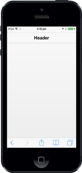

# Header Title

To specify the Header Title, set the data-ej-title attribute. By default, the attribute value is set to “Title’. Refer to the following code example.



 



The following screenshot displays the Title.

