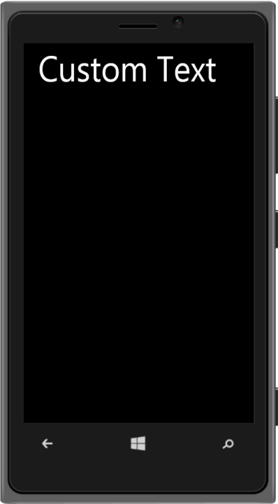

## Windows specific customization

You can set the Windows Specific properties to the control by accessing this property.

### WindowsCustomText

In the Windows phones, by default, the Header title's text is in the lower case irrespective of whatever case is provided for the title. To disable this behavior, set the “data-ej-windows-enablecustomtext” attribute to true. By default, the attribute value is set to false.





The following screenshot displays the Windows specific customization:

{{ '' | markdownify }}
{:.image }

