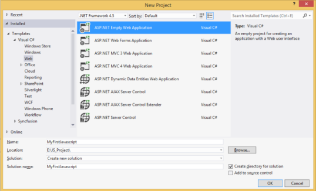
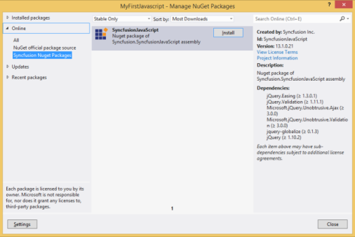
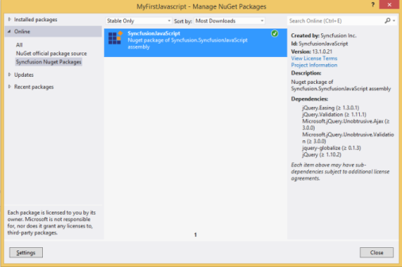
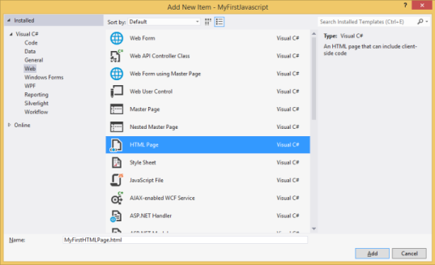
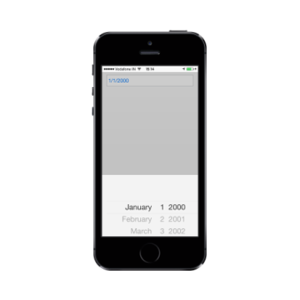

# Control Initialization

## AppView

AppView acts as a base container for an EJ Mobile application and also acts like a wrapper for the mobile page content. It is considered as a view page with which you can perform various page transitions while navigating from one page to another. All the EJ mobile widgets should be defined within this appview container, so that it can performs its functionality properly, according to the devices with proper dimensions. A mobile application can consist of any number of AppViews, that may, in turn, consist of other navigational widgets like anchor button and so on. 

### Initializing AppView [optional]

Set the data-role attribute of a “div” to appview as shown in the following code example to initialize an AppView. It should be created as an immediate child of the body element.


<body>

      <!-- appview initialization -->

      
 Mobile JS Application 

      

</body>



N> When the application does not contain an appview element, it is created automatically and wraps the content of the application before all the EJ mobile widgets are initialized. 

#### Page Navigation

The AppView is linked with single or multiple pages and takes care of the page transformation through navigational elements. By using App.transferPage within the script section, you can manually navigate to external pages through the specified URL.





N> Before specifying the destined URL of the file, make sure that the file with the specific name already exists in that location.

#### Page Transitions

Transitions are the animations that are performed during a navigation from one appview to another. The supported transitions for Appview are as follows,

* Slide 
* Pop
* Turn

The specific transitions can be assigned by using the data-ej-apptransition for the navigational element. Also, it takes care of the default slide transitions according to the mobile devices like iOS, Android, Windows.

#### Slide

In this transition, the currently visible AppView slides to the left and the new AppView slides to the right, by default. You can also change the direction of the transition from left to right or top to bottom. It is the default transition for iOS render mode.

#### Pop

In this transition, the currently visible AppView fades out and the new AppView zooms in from the center of the old AppView. It is the default transition for Android render mode.

#### Turn

In this transition, the old AppView turns leftwards and the new AppView appears from behind as if turned from right. The supported directions are Turn In and Turn Out. This is the default transition for Windows render mode.


   

       <!--Application contents-->

       <a href="page2.html" data-ej-apptransition="pop">Move to Page 2</a>

   



To reverse a particular page transition and to simulate a history back navigation, you need to set the data-ej-appdirection attribute of the navigation element to reverse as shown here,


   

       <!--Application contents-->

       <a href="page2.htm" data-ej-apptransition="pop" data-ej-appdirection="reverse">Move to Page 2</a>

   



## Adding Meta tags [optional]

Meta tags are required to render the web pages according to the device dimensions and to override some of the default browser behaviors. When it is not added explicitly, the following Meta tags are added automatically to your document on initialization of the appview.



<!DOCTYPE html>

<html xmlns="http://www.w3.org/1999/xhtml">

  <head>

    <meta charset="UTF-8">

    <meta http-equiv="X-UA-Compatible" content="IE=edge,chrome=1">

    <meta name="apple-mobile-web-app-capable" content="yes">

    <meta name="viewport" content="width=device-width, initial-scale=1, maximum-scale=1, user-scalable=0">

    <title>My first HTML page</title>

    <!-- CSS and Script reference section -->

  </head>

  <body>    

  </body>

</html>



The first line of meta tag specifies the character-set encoding for the HTML document.

The next meta tag specifies the mode of Internet Explorer to use when rendering the page in IE browser and also adds the support for Chrome Frame in Internet Explorer.

The third meta tag specifies whether to display the webpage on a full screen mode in Safari browser on the device. When the content is set to yes, the web application runs in full-screen mode.

The last meta tag fixes the viewport of the page to the dimensions of the device and also disables the default zooming behavior of the browser.

## Control Creation

The Syncfusion mobile controls can be initialized by using either of the following ways,

* Manual reference of Scripts and Stylesheets in a HTML page.
* Using Syncfusion Nuget Package in Visual Studio for Scripts and Stylesheet reference.
* Using CDN link for Script and Stylesheet reference.

The basic syntax for creating any of the Syncfusion mobile widget is as follows,



1. <<HtmlTag> data-role="<ejm-plug-in-name>" data-ej-"<PropertyName>"= "<value>"/> [Recommended method]

Example:  <input id="myDate" data-role="ejmdatepicker" data-ej-value="01/01/2000" />

2. $(“jquery-selector”).<ejm-plugin-name>({ propertyName1 : value1, propertyName2: value2, … });

Example:  $("#myDate").ejmDatePicker({ value: "01/01/2015", dateFormat: "MM/dd/yyyy" });



N> All the mobile widget names begins with the prefix „__ejm__“ and its other properties needs to be prefixed with the keyword „__data-ej-“__, while rendering in an unobtrusive way.

### Manual reference of Scripts and Stylesheets in a HTML page

The Mobile JavaScript application creates the pages with the mobile based Viewport tags to the application so that it performs its proper functionality according to the devices with proper dimensions.

#### HTML file creation

Create a basic HTML file with the basic template as shown here and save it with a unique name in a separate folder in any of your System locations.



<!DOCTYPE html>

  <html xmlns="http://www.w3.org/1999/xhtml">

       <head>

          <title>My first Mobile page</title>

       </head>

       <body>    

       </body>

  </html>

  
  
For example, when you have created a folder named JS_Sample and placed the above HTML file in it, then create two new folders Scripts and Content under that root folder JS_Sample to maintain the scripts and stylesheets respectively as shown here,

 _Sample folder containing the Scripts & Content folder_

#### Adding the required Stylesheets into the Content folder

Navigating to the specified location given here, you can find all the required mobile related theme folders – from where you need to copy the ej.mobile.all.min.css file into the Content folder of your application – so as to render the mobile widgets with their unique style and theme,



<installed location>\Syncfusion\Essential Studio\13.1.0.21\JavaScript\assets\css\mobile

For example, If you have installed the Essential Studio package within C:\Program Files (x86), then navigate to the below location,

C:\Program Files (x86)\Syncfusion\Essential Studio\13.1.0.21\JavaScript\assets\css\mobile



Create a first level sub-folder named “ej” within the Content folder. Now, create another sub-folder namely “mobile” within the ej folder and place the copied file “ej.mobile.all.min.css”, that includes the stylesheets of all the themes combined into a single css file into it as shown here,

_css file copied into the Content folder of the Sample Project_

Include the reference to the copied stylesheet file, ej.mobile.all.min.css, into your HTML file. Referred here is the combined theme file, within the head section as shown here,



<!DOCTYPE html>

<html xmlns="http://www.w3.org/1999/xhtml">

    <head>

        <title>My first HTML page</title>

        <link href="Content/ej/mobile/ej.mobile.all.min.css" rel="stylesheet" />

    </head>

    <body>    

    </body>

</html>



#### Adding the required JavaScript files

Adding and referring the required JavaScript files into the same HTML file plays an important role, without which the Syncfusion controls cannot be created. It requires the following mandatory common script files,

* jquery-1.10.2.min.js 
* jquery.globalize.min.js
* jsrender.min.js

Navigating to the specified location, you can find the above specified dependency script files that you need to copy and paste into the Scripts folder of your application,


<installed location>\ Syncfusion\Essential Studio\13.1.0.21\JavaScript\assets\external 

For example, If you have installed the Essential Studio package within C:\Program Files (x86), then navigate to the below location,

C:\Program Files (x86)\Syncfusion\Essential Studio\13.1.0.21\JavaScript\assets\external



Apart from the above common scripts, it is also necessary to refer the ej.mobile.all.min.js file, that contains all the JavaScript mobile components scripts together in a minified format.

N> ej.mobile.all.min.js file bundles together the scripts of all the EJ mobile components as well as the other common scripts such as ej.core, ej.unobtrusive, ej.mobile.core, ej.mobile.application, ej.touch & so on.

Navigate to the specified location and copy the ej.mobile.all.min.js file, that needs to then be pasted onto the ej sub-folder, create a new sub-folder ej under the Scripts folder, within the Scripts folder. 


<installed location>\ Syncfusion\Essential Studio\13.1.0.21\JavaScript\assets\scripts\mobile

For example, If you have installed the Essential Studio package within C:\Program Files (x86), then navigate to the below location,

C:\Program Files (x86)\Syncfusion\Essential Studio\13.1.0.21\JavaScript\assets\scripts\mobile


Now, include the reference to it in your HTML file within the head section as shown here,



<!DOCTYPE html>

<html xmlns="http://www.w3.org/1999/xhtml">

  <head>

    <title>My first HTML page</title>

<link href="Content/ej/mobile/ej.mobile.all.min.css" rel="stylesheet" />

    

    

    

  </head>

  <body>    

  </body>

</html>



N> The order of the reference to the script files made in the above section should be maintained in the same manner as mentioned above.

#### Adding Syncfusion Mobile Widget into your HTML page

To add any of the Syncfusion Mobile controls into your HTML page,

1. Add the <input> element within the appview container and initialize its data-role attribute with ejmDatePicker widget name and then further define its other properties prefixed with the keyword data-ej as shown below.

N> The meta tag also has been added to render the application based on the device dimensions



<!DOCTYPE html>

<html xmlns="http://www.w3.org/1999/xhtml">

    <head>

        <meta id="viewport" name="viewport" content="width=device-width, initial-scale=1.0,maximum-scale=1.0, user-scalable=no" />

        <title>My first HTML page</title>

<link href="Content/ej/mobile/ej.mobile.all.min.css" rel="stylesheet" />

        

        

        

        

    </head>

    <body>

     
     

       

       <!-- Initialization of ejmDatePicker widget-->

       <input id="startDate" data-role="ejmdatepicker" data-ej-value="01/01/2000" />

     

    </body>

</html>



Open your HTML page in any of the mobile browser and the screen displays the DatePicker widget as shown here,

### Using Syncfusion Nuget Package in Visual Studio for Scripts and Stylesheet reference

Start Visual Studio. Create a new ASP.NET Empty Web Application or ASP.NET Empty Website from File -> New -> Project/Website and save it with a meaningful name. Used here is the ASP.NET Empty Web application.

#### Configuring and Installing Nuget into your project

To add the required scripts and css files automatically into your Project - Configure the Syncfusion Nuget Package for JavaScript in Visual Studio initially, before proceeding with the following installation procedure.

1. Right-click on your project in the Solutions Explorer and select “Manage Nuget Packages” options from the sub-menu that pop-up on the screen. In the Manage Nuget Packages dialog, select the Syncfusion Nuget Packages within the Online tab, that displays the list of available packages in it, as shown here.

You need to install the SyncfusionJavaScript package shown in the above image just by clicking the Install button. The following image depicts the Nuget Packages for JavaScript have been successfully installed into your project.

Once the package installation is completed, all the required scripts and css files are automatically added to your application. 

#### Adding HTML page in your application

Right-click on your Project in the Solution Explorer. Select Add -> New Item -> HTML Page and add it to your application. The blank HTML page gets added to your application.

#### Adding reference to the required Stylesheets

Since the stylesheets are automatically loaded into the Content folder of your application, include the specific theme reference to the newly created HTML file by referring the appropriate css file from a particular theme folder, within the head section as shown here,



<!DOCTYPE html>

<html xmlns="http://www.w3.org/1999/xhtml">

    <head>

        <title>My first HTML page</title>

<link href="Content/ej/mobile/ej.mobile.all.min.css" rel="stylesheet" />

    </head>

    <body>    

    </body>

</html>



#### Adding reference to the required JavaScript files

It is mandatory to include the reference to the required JavaScript files in your HTML page, so as to render the Syncfusion controls properly as shown here,



<!DOCTYPE html>

<html xmlns="http://www.w3.org/1999/xhtml">

    <head>

       <title>My first HTML page</title>

<link href="Content/ej/mobile/ej.mobile.all.min.css" rel="stylesheet" />

       

       

       

    </head>

    <body>    

    </body>

</html>    



N> The order of the reference to the script files made in the above section should be maintained in the same manner as mentioned above.

##### Adding Syncfusion mobile Widget into your HTML page

Add the <input> element within the appview container and initialize its data-role attribute with ejmDatePicker widget name and then further define its other properties prefixed with the keyword data-ej as shown here.

N> The meta tag also has been added to render the application based on the device dimensions.



<!DOCTYPE html>

<html xmlns="http://www.w3.org/1999/xhtml">

    <head>

        <meta id="viewport" name="viewport" content="width=device-width, initial-scale=1.0,maximum-scale=1.0, user-scalable=no" />

        <title>My first HTML page</title>

<link href="Content/ej/mobile/ej.mobile.all.min.css" rel="stylesheet" />

        

        

        

        

    </head>

    <body>

     
  

       

       <!--Container for ejmDatePicker widget-->

       <input id="startDate" data-role="ejmdatepicker" data-ej-value="01/01/2000" />

       
     

     

    </body>

</html>



Open your HTML page in any mobile browser and the screen displays the DatePicker widget as shown here.

### Using CDN link for Script and Stylesheet reference 

With this method, you can skip the process of copying and pasting the required Script and Stylesheets into your application. Instead, you can directly refer the cdn link references for the scripts and css in your HTML page.

#### HTML file creation

Create a basic HTML file and directly refer all the required cdn links for the Script and Stylesheet reference within the <head> section as shown here. For other cdn links, refer the CDN section in the introduction part.

Referred here is the cdn link of ej.mobile.all.min.css. Likewise, any of the available themes can be referred in the following highlighted code, as per your needs.



<!DOCTYPE html>

<html xmlns="http://www.w3.org/1999/xhtml">

    <head>

        <title>My first HTML page</title>

        <link href="http://cdn.syncfusion.com/13.1.0.21/js/mobile/ej.mobile.all.min.css" rel="stylesheet" />

        

        

        

        

    </head>

    <body>    

    </body>

</html>



#### Adding Syncfusion mobile widget into your HTML page

Add the <input> element within the appview container and initialize its data-role attribute with ejmDatePicker widget name and then further define its other properties prefixed with the keyword data-ej as shown here,



<!DOCTYPE html>

<html xmlns="http://www.w3.org/1999/xhtml">

    <head>

        <title>My first HTML page</title>

<link href="http://cdn.syncfusion.com/13.1.0.21/js/mobile/ej.mobile.all.min.css" rel="stylesheet" />

        

        

        

        

    </head>

    <body>

     
     

       <!--Container for ejmDatePicker widget-->

       <input id="startDate" data-role="ejmdatepicker" data-ej-value="01/01/2000" />

     

    </body>

</html>



