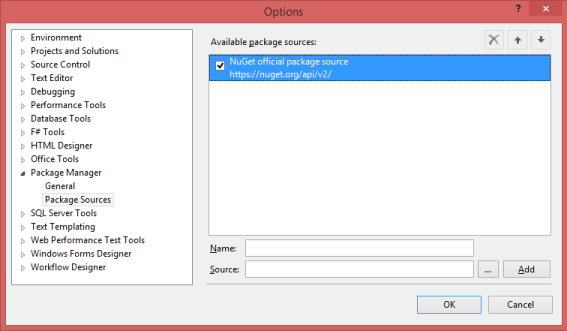
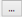
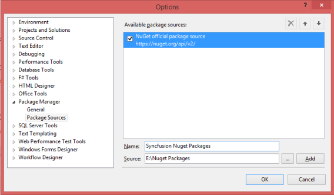
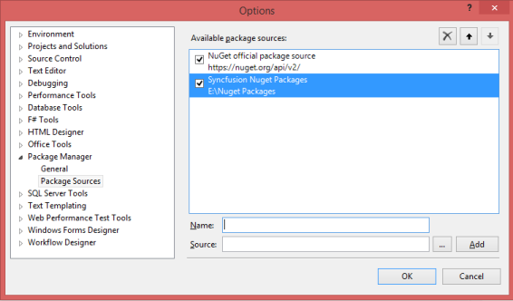

## Installation & Deployment

### For Windows Users

Download the setup file (.exe) of Essential Studio for JavaScript product from this [link](http://www.syncfusion.com/downloads/javascript) with your Syncfusion account and follow the steps mentioned in the [setup guide](http://help.syncfusion.com/ug/common/index.html) to install the specific/entire platform on your machine.

#### Install Location

The following root location contains all the Syncfusion assemblies, scripts, stylesheets and dashboard samples.



<installed location>\Syncfusion\Essential Studio\13.1.0.21\

For example, whenyou have installed the Essential Studio package within C:\Program Files (x86), then navigate to the following location,

C:\Program Files (x86)\Syncfusion\Essential Studio\13.1.0.21\



You can find the JavaScript mobile Samples from the Samples folder present within the above specified location that includes separate folders for both the web and mobile samples separately.

##### JavaScript Folder Structure & Asset Details

The following location is the root JavaScript folder that contains two important sub-folder,

* assets
* Src

<installed location>\Syncfusion\Essential Studio\13.1.0.21\ JavaScript\

For example, whenyou have installed the Essential Studio package within C:\Program Files (x86), then navigate to the following location,

C:\Program Files (x86)\Syncfusion\Essential Studio\13.1.0.21\JavaScript\

assets 

The assets folder comprises of all the minified versions of the external and common Scripts, Stylesheets and TypeScript files under their corresponding folders. It includes 4 sub-folders,

* CSS
* External
* Scripts
* TypeScript

* The stylesheets required for supporting the theming and styling of the Syncfusion components (both mobile and web) are available in a minified format within the css folder. The css folder is again sub-categorized into mobile and web where all the mobile related css files are present within the mobile folder and all those related to web components are availed within the web folder. 

* The external folder contains the external dependency files such as jquery, jquery.easing, jsrender, Culture files and other third-party script files.

* The scripts folder includes all the Syncfusion components UI scripts in the minified format for both web and mobile components. 

* The TypeScript folder includes the default type-definition file (ej.widgets.all.d.ts) for the purpose of supporting classes, modules, strong-type checking during compile time itself and also provides IntelliSense support within the JavaScript environment.

Src

This folder comprises of the sub-folder assets-src that includes all the non-minified versions of the Scripts and Stylesheets separately for all the individual Syncfusion widgets.

The same folders available within the assets folder such as, css, external, scripts, typescript are made available within the assets-src folder too, in the non-minified format that can be used for performing any customizations. 

The location where these non-minified files are available is as follows,

<installed location>\Syncfusion\Essential Studio\13.1.0.21\ JavaScript\Src\assets-src

For example, when you have installed the Essential Studio package within C:\Program Files (x86), then navigate to the following location,

C:\Program Files (x86)\Syncfusion\Essential Studio\13.1.0.21\JavaScript\Src\assets-src

### For MAC and Linux OS Users

For MAC OS and Linux users, a zip folder is provided instead of .exe file that includes the following main folders. (no installation required)

Assets – It contains all the Essential JavaScript scripts and CSS as mentioned previously.

External – It includes the external jQuery dependencies, culture files and other third-party scripts.

Samples – This folder contains samples of all the Syncfusion JavaScript controls. You can directly open the html sample page in any of the browser to view the output.

It also includes other folders such as, Release Notes, License Agreement and Read Me. The control creation is same as described in the Getting Started section. Here, the scripts and Stylesheets should be referred from the Assets folder into their respective HTML pages. 

### Configuring Syncfusion Nuget Packages

The steps to download and configure the Syncfusion Nuget Packages in Visual Studio are as follows,

* Download the Syncfusion Nuget Packages for JavaScript from [here](http://nuget.syncfusion.com/login) and save it in your system. Unzip the downloaded folder and copy the SyncfusionJavaScript.13.1.0.21.nupkg package in it. Create a new folder Nuget Packages in any of the particular location in your system and place the copied file into it.

* In Visual Studio, navigate to Tools -> Library Package Manager -> Package Manager Settings, the Options pop-up appears on the screen as follows.

{{ '' | markdownify }}
{:.image }

* Select Package Manager -> Package Sources in the above pop-up and click on the {{ '' | markdownify }}
{:.image }
 button to navigate to the location where the above collection of nuget packages are located within the Nuget Packages folder in your system.

{{ '' | markdownify }}
{:.image }

> _Note: The Source textbox in the above image denotes the location of the nuget packages in your machine and the Name section, allows you to provide a unique name that you refer in the package installation section later._ 

* Now click the Add button and the package name is listed in the Available package sources list as displayed in the following screenshot and then Click OK.

{{ '' | markdownify }}
{:.image }

