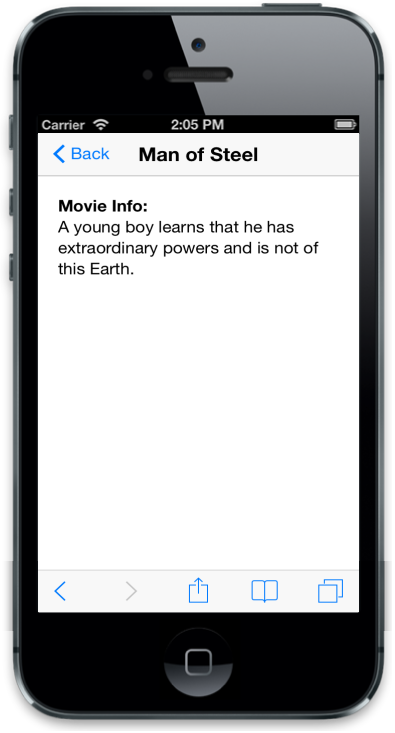

## Ajax Navigation

### EnableAjax

In the ListView widget, when all the items have navigation page to be loaded through Ajax content, then data-ej-enableajax attribute is set to true. 

Sample.html



  

      <ul>

          <li data-ej-text="Man of Steel" data-ej-href="load1.html"></li>

          <li data-ej-text="World War Z" data-ej-href="load2.html"></li>

          <li data-ej-text="Monsters University" data-ej-href="load3.html"></li>

      </ul>

  



Add the following styles to the html



        .listrightdiv

        {

            padding:20px;

        }



Load1.html



      

<b>Movie Info:</b>

      

      A young boy learns that he has extraordinary powers and is not of this Earth.

      



Load2.html



<b>Movie Info:</b>

      

      The story revolves around United Nations employee Gerry Lane (Pitt).

      



Load3.html



<b>Movie Info:</b>

      

      Mike Wazowski and James P. Sullivan are an inseparable pair, but that wasn't always the case.

      



The following screenshot displays the Enable Ajax:

{{ '' | markdownify }}
{:.image }

{{ '' | markdownify }}
{:.image }

> _Note: When the Ajax navigation is only for a specific item, then use this atribute inside item specific configuration. (In JS, use this attribute “data-ej-enableajax” in specific “li” tag in html, while in MVC, set through EnableAjax)._

### AjaxSettings

In Ajax method, the ListView widget loads the content with default jQuery settings. You can customize it as in normal Ajax method through data-ej-ajaxsettings attribute. The following options are available.

1. Type
2. Cache
3. Async
4. DataType
5. ContentType
6. URL
7. Data



<!--Sample.html -->

      <ul>

          <li data-ej-text="Man of Steel" data-ej-href="load1.html"></li>

          <li data-ej-text="World War Z" data-ej-href="load2.html"></li>

          <li data-ej-text="Monsters University" data-ej-href="load3.html"></li>

      </ul>

  



The following screenshots display the Ajax Settings:

{{ '' | markdownify }}
{:.image }

{{ '' | markdownify }}
{:.image }

### EnableCache

data-ej-enablecache attribute is used to prevent loading Ajax content every time. This is set to true only when the content is not updated for each request.



<!--Sample.html -->

   

            <ul>

                <li data-ej-text="Man of Steel" data-ej-enableajax="true" data-ej-href="load1.html"></li>

                <li data-ej-text="World War Z" data-ej-enableajax="true" data-ej-href="load2.html"></li>

                <li data-ej-text="Monsters University" data-ej-enableajax="true" data-ej-href="load3.html"></li>

            </ul>

   



