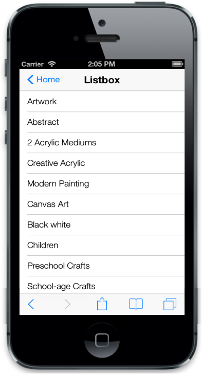

# Customize Header

In the ListView, you can enable the built-in Header support. To show or hide the Header in the ListView, use the data-ej-showheader attribute. By default, the ListView is rendered with the Header. You can set the title for the Header by using the data-ej-headertitle attribute.



	<ul>

		<li data-ej-text="Artwork"></li>

		<li data-ej-text="Abstract"></li>

		<li data-ej-text="2 Acrylic Mediums"></li>

		<li data-ej-text="Creative Acrylic"></li>

		<li data-ej-text="Modern Painting"></li>

		<li data-ej-text="Canvas Art"></li>

		<li data-ej-text="Black white"></li>

		<li data-ej-text="Children"></li>

		<li data-ej-text="Preschool Crafts"></li>

		<li data-ej-text="School-age Crafts"></li>

	</ul>



In some cases, for navigation purposes you may want to show Back button in the ListViewHeader. To achieve this, use data-ej-showheaderbackbutton attribute. By default, the ListView is not rendered with Header Back button in the parent page. To customize the text shown in the ListViewHeader Back button, the data-ej-headerbackbuttontext attribute is used. 



	<ul>

		<li data-ej-text="Artwork"></li>

		<li data-ej-text="Abstract"></li>

		<li data-ej-text="2 Acrylic Mediums"></li>

		<li data-ej-text="Creative Acrylic"></li>

		<li data-ej-text="Modern Painting"></li>

		<li data-ej-text="Canvas Art"></li>

		<li data-ej-text="Black white"></li>

		<li data-ej-text="Children"></li>

		<li data-ej-text="Preschool Crafts"></li>

		<li data-ej-text="School-age Crafts"></li>

	</ul>



The following screenshot displays the Customize Header:

While working with hybrid mobile application development for iOS, Android and Windows Platforms, you do not need to specify show/hide Header for each platform. The data-ej-hideforunsupporteddevice attribute is used to hide/show Header by its native aspects. For example, in some scenarios, Header may not be needed for Android and Windows Platforms (when tab control is used in an application), but in iOS, Header is needed since the tab is placed at the bottom of the page. Considering these scenarios, this attribute is provided. Enabling this attribute hides Header in Android and Windows Platform, and shows only in iOS platform.



	<ul>

		<li data-ej-text="Artwork"></li>

		<li data-ej-text="Abstract"></li>

		<li data-ej-text="2 Acrylic Mediums"></li>

		<li data-ej-text="Creative Acrylic"></li>

		<li data-ej-text="Modern Painting"></li>

		<li data-ej-text="Canvas Art"></li>

		<li data-ej-text="Black white"></li>

		<li data-ej-text="Children"></li>

		<li data-ej-text="Preschool Crafts"></li>

		<li data-ej-text="School-age Crafts"></li>

	</ul>

