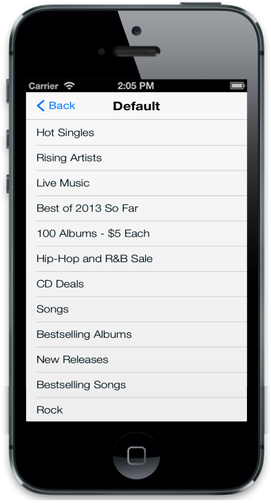
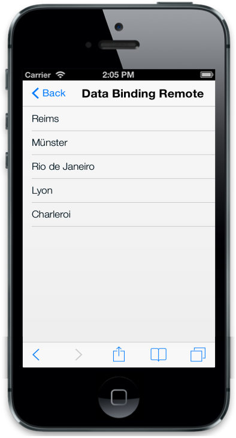
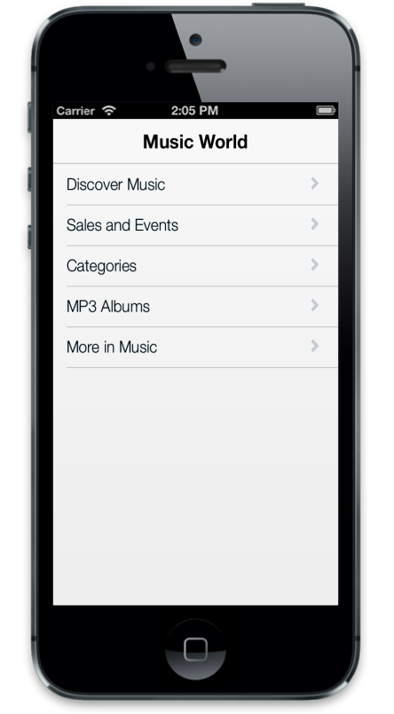
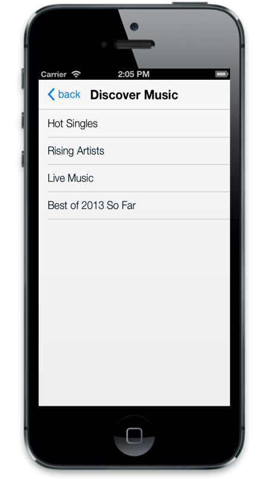

# Data Binding

## Local Data Binding

Essential Studio mobile JS ListView provides support for Data Binding. data-ej-databinding provides a simple and consistent way for applications to present and interact with data. Elements can be bounded to data from a variety of data sources. In local Data Binding, the data source is written inside the program. Then it is handled by the ListView control. By using data-ej-dataBinding attribute, you can enable Data Binding. data-ej-datasource attribute is used to get the data source that holds the list items.



    

    



To include datasource, add the following script.



        window.dbitem =

            [

                 { "text": "Hot Singles" },

                 { "text": "Rising Artists" },

                 { "text": "Live Music" },

                 { "text": "Best of 2013 So Far" },

                 { "text": "100 Albums - $5 Each" },

                 { "text": "Hip-Hop and R&B Sale" },

                 { "text": "CD Deals" },

                 { "text": "Songs" },

                 { "text": "Bestselling Albums" },

                 { "text": "New Releases" },

                 { "text": "Bestselling Songs" },

                 { "text": "Rock" },

                 { "text": "Gospel" },

                 { "text": "Latin Music" },

                 { "text": "Jazz" },

                 { "text": "Music Trade-In" },

                 { "text": "Redeem a Gift Card" },

                 { "text": "Band T-Shirts" },

                 { "text": "Mobile MVC"}];



The following screenshot displays the Local Data Binding:

## Remote Data Binding

In Remote Data Binding, the data is retrieved from a particular URL unlike the local Data Binding and then it is handled by the ListView control. By using data-ej-databinding attribute, you can enable Data Binding. Datasource is used to get the data that holds the list items.





To include datasource, add the following script.



        // DataManager creation.

        window.datasource = ej.DataManager({

            url: "http://mvc.syncfusion.com/Services/Northwnd.svc/"

        });

        window.dbitem = { "text": "ShipCity" };



The following screenshot displays the remote Data Binding:

## FieldSettings

data-ej-fieldsettings attribute is used to map the DataSource field with the list item fields. In addition to the list item specific properties, the following fields are available while mapping.

<table>
<tr>
<th>
Properties</th><th>
Definition</th></tr>
<tr>
<td>
ParentPrimaryKey</td><td>
In DB, you can relate any child item to some other item. ‘PrimaryKey’ is used to set the parent item. ‘ParentPrimaryKey’ defines the ‘PrimaryKey’ of some parent items to identify which item is its parent.</td></tr>
<tr>
<td>
Attributes</td><td>
In DB, you can define the desired class name or styles for the list item through ‘Attributes’ field.</td></tr>
</table>



    

    



To include datasource, add the following script.



        window.dbitem =

            [{ "Texts": "Discover Music", "PrimaryKeys": "1", "Title": "Discover Music","BackIconText":"back" },

                 { "Texts": "Hot Singles", "ParentPrimaryKeyss": "1" },

                 { "Texts": "Rising Artists", "PrimaryKeyss": null, "ParentPrimaryKeyss": "1" },

                 { "Texts": "Live Music", "ParentPrimaryKeyss": "1" },

                 { "Texts": "Best of 2013 So Far", "ParentPrimaryKeyss": "1" },

            { "Texts": "Sales and Events", "PrimaryKeys": "2", "Title": "Sales and Events", "BackIconText": "back" },

                 { "Texts": "100 Albums - $5 Each", "ParentPrimaryKeyss": "2" },

                 { "Texts": "Hip-Hop and R&B Sale", "ParentPrimaryKeyss": "2" },

                 { "Texts": "CD Deals", "ParentPrimaryKeyss": "2" },

            { "Texts": "Categories", "PrimaryKeys": "3", "Title": "Categories", "BackIconText": "back" },

                 { "Texts": "Songs", "ParentPrimaryKeyss": "3" },

                 { "Texts": "Bestselling Albums", "ParentPrimaryKeyss": "3" },

                 { "Texts": "New Releases", "ParentPrimaryKeyss": "3" },

                 { "Texts": "Bestselling Songs", "ParentPrimaryKeyss": "3" },

            { "Texts": "MP3 Albums", "PrimaryKeys": "4", "Title": "MP3 Albums", "BackIconText": "back" },

                 { "Texts": "Rock", "ParentPrimaryKeyss": "4" },

                 { "Texts": "Gospel", "ParentPrimaryKeyss": "4" },

                 { "Texts": "Latin Music", "ParentPrimaryKeyss": "4" },

                 { "Texts": "Jazz", "ParentPrimaryKeyss": "4" },

            { "Texts": "More in Music", "PrimaryKeys": "5", "Title": "More in Music", "BackIconText": "back" },

                 { "Texts": "Music Trade-In", "ParentPrimaryKeyss": "5" },

                 { "Texts": "Redeem a Gift Card", "ParentPrimaryKeyss": "5" },

                 { "Texts": "Band T-Shirts", "ParentPrimaryKeyss": "5" },

                 { "Texts": "Mobile MVC", "ParentPrimaryKeyss": "5"}];

        window.musicFields = {

            "text": "Texts",

            "primaryKey": "PrimaryKeys",

            "parentPrimaryKey": "ParentPrimaryKeyss",

            "childHeaderTitle": "Title",

            "childHeaderBackButtonText":"BackIconText"

        };



The following screenshots display the Field Settings:

_After navigation_

## Query

This feature in the ListView is used to fetch data from the DataSource before listing them. A Query is a constraint that is used to take only the data defined through data-ej-query attribute.



    

    



To include datasource, add the following script.



        // DataManager creation.

        window.datasource = ej.DataManager({

            url: "http://mvc.syncfusion.com/Services/Northwnd.svc/"

        });

        window.dbitem = { "text": "ShipCity" };



