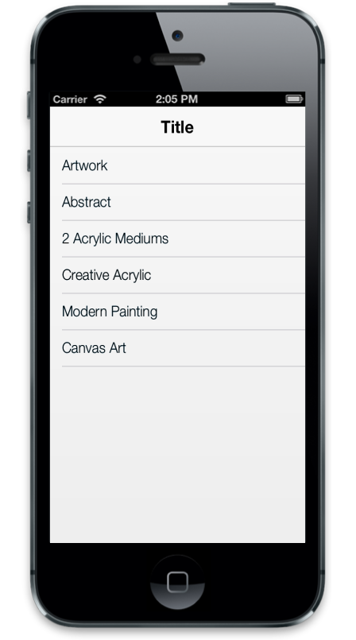

# Dimensions

To customize the ListView dimensions, data-ej-width and data-ej-height properties are used.



<ul>

<li data-ej-text="Artwork"></li>

<li data-ej-text="Abstract"></li>

<li data-ej-text="2 Acrylic Mediums"></li>

<li data-ej-text="Creative Acrylic"></li>

<li data-ej-text="Modern Painting"></li>

<li data-ej-text="Canvas Art"></li>

<li data-ej-text="Black white"></li>

<li data-ej-text="Children"></li>

<li data-ej-text="Preschool Crafts"></li>

<li data-ej-text="School-age Crafts"></li>

</ul>



The following screenshot displays the Dimensions:

## AutoAdjustScrollHeight

The data-ej-autoadjustscrollheight is a Boolean attribute that lets you adjust the scrolling content height automatically in case you have “ejm” elements with fixed position in your application. Default value is set to true.



<ul>

<li data-ej-text="Artwork"></li>

<li data-ej-text="Abstract"></li>

<li data-ej-text="2 Acrylic Mediums"></li>

<li data-ej-text="Creative Acrylic"></li>

<li data-ej-text="Modern Painting"></li>

<li data-ej-text="Canvas Art"></li>

<li data-ej-text="Black white"></li>

<li data-ej-text="Children"></li>

<li data-ej-text="Preschool Crafts"></li>

<li data-ej-text="School-age Crafts"></li>

</ul>



## AutoAdjustHeight	

When the data-ej-autoadjustheight attribute is set to true, it sets the Height of the list element automatically based on the window height. Default value is set to false.



<ul>

<li data-ej-text="Artwork"></li>

<li data-ej-text="Abstract"></li>

<li data-ej-text="2 Acrylic Mediums"></li>

<li data-ej-text="Creative Acrylic"></li>

<li data-ej-text="Modern Painting"></li>

<li data-ej-text="Canvas Art"></li>

<li data-ej-text="Black white"></li>

<li data-ej-text="Children"></li>

<li data-ej-text="Preschool Crafts"></li>

<li data-ej-text="School-age Crafts"></li>

</ul>



