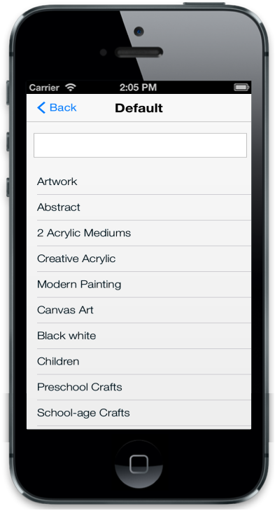
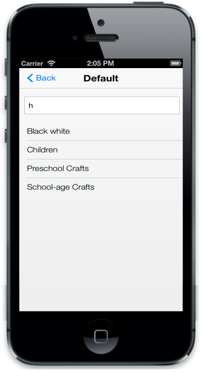

# Filtering

Filtering is one of the key features in the ListView control. Filtering option is added into the ListView control when the data-ej-enablefiltering attribute is set to true. This enables a simple interface to filter items from a large collection of ListView items.



	<ul>

		<li data-ej-text="Artwork"></li>

		<li data-ej-text="Abstract"></li>

		<li data-ej-text="2 Acrylic Mediums"></li>

		<li data-ej-text="Creative Acrylic"></li>

		<li data-ej-text="Modern Painting"></li>

		<li data-ej-text="Canvas Art"></li>

		<li data-ej-text="Black white"></li>

		<li data-ej-text="Children"></li>

		<li data-ej-text="Preschool Crafts"></li>

		<li data-ej-text="School-age Crafts"></li>

	</ul>



The following screenshots display the Filtering:

