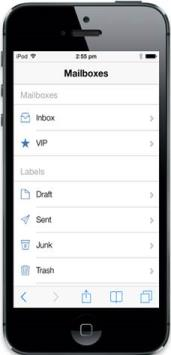
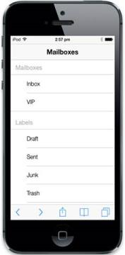
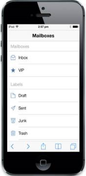
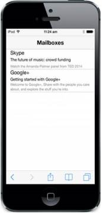

# Getting Started

Essential JavaScript Mobile ListView widget builds an interactive list view interface. This control allows you to select an item from a list-like interface and provides the infrastructure to display a set of data items in different layouts or views. Lists display data, data navigation, result lists, and data entry.

{  | markdownify }
{:.image }

The following steps help you to add a ListView control for a mobile application that views a list of items such as images, text and navigates to the child item when you click a list item.

## Create a Basic Mobile Layout

Essential JavaScript Mobile ListView widget is rendered, either by specifying static content on a list. The following steps help you create a basic ListView for your application.

Create an HTML file and add the following template to the HTML file.



<!DOCTYPE html>

<html>

<head>

    <meta id="viewport" name="viewport" content="width=device-width, initial-scale=1.0,maximum-scale=1.0, user-scalable=no" />

    <title>ListView</title>

<link href="[http://cdn.syncfusion.com/13.1.0.21/js/mobile/ej.mobile.all.min.css](http://cdn.syncfusion.com/13.1.0.21/js/mobile/ej.mobile.all.min.css)" rel="stylesheet" />

      

</head>

<body>

    <div data-role="appview">

        <!--Add Header Element Here-->

        <!--Add Listview Element Here-->

    

</body>

</html>



## Create Grouped List

Here, you can learn how ListView with items are grouped together using the grouplist feature in ListView. To enable this, you can set the “data-ej-enablegrouplist” attribute to “True” and you can also provide individual header titles for each group by setting the “data-ej-grouplisttitle” attribute. The list &lt;li&gt; element with “data-ej-text” attribute is added to render list items. By default the content scrolling is enabled for ListView content.



<div data-role="ejmlistview" id="grouplistsamp" data-ej-showheader="true" data-ej-enablegrouplist="true" data-ej-headertitle="MailBoxes">

    <ul data-ej-grouplisttitle="Mailboxes">

        <!--Add Listview Images Here-->

        <li data-ej-text="Inbox"></li>

        <li data-ej-text="VIP"></li>

    </ul>

    <ul data-ej-grouplisttitle="Labels">

        <li data-ej-text="Draft"></li>

        <li data-ej-text="Sent"></li>

        <li data-ej-text="Junk"></li>

        <li data-ej-text="Trash"></li>

        <li data-ej-text="All Mail"></li>

        <li data-ej-text="Mail"></li>

    </ul>

       



Run the above code and you can see the following output.

{  | markdownify }
{:.image }

## Add Images

You can add images to your ListView items by specifying the image class name for individual items using ‘data-ej-imageclass’ attribute.

The following code example displays how to add images to the ListView.



    

        <ul data-ej-grouplisttitle="Mailboxes">

            <!-- Adding the Child Items for List -->

            <li data-ej-text="Inbox" data-ej-imageclass="icn-inbox"></li>

            <li data-ej-text="VIP" data-ej-imageclass="icn-vip"></li>

        </ul>

        <ul data-ej-grouplisttitle="Labels">

            <li data-ej-text="Draft" data-ej-imageclass="icn-draft"></li>

            <li data-ej-text="Sent" data-ej-imageclass=" icn-sent"></li>

            <li data-ej-text="Junk" data-ej-imageclass=" icn-junk"></li>

            <li data-ej-text="Trash" data-ej-imageclass="icn-trash"></li>

            <li data-ej-text="All Mail" data-ej-imageclass="icn-allmail"></li>

            <li data-ej-text="Mail" data-ej-imageclass="icn-mail"></li>

        </ul>

    



To set the ListView image from sprite and to position the listview images properly use the following styles.

You can define the image classes specified for the list items as follows.



            [class*="icn-"] {

                background-image: url("http://js.syncfusion.com/ug/mobile/content/listview/sprite.png");

                background-repeat: no-repeat;

            }

            .icn-inbox {

                background-position: 0 -157px;

            }

            .icn-vip {

                background-position: 0 -530px;

            }

            .icn-draft {

                background-position: 0 -78px;

            }

            .icn-sent {

                background-position: 0 -372px;

            }

            .icn-junk {

                background-position: 0 -227px;

            }

            .icn-trash {

                background-position: 0 -157px;

            }

            .icn-allmail {

                background-position: 0 0;

            }

            .icn-mail {

                background-position: 0 -297px;

            }



Run the above code and you can see the following output.

{  | markdownify }
{:.image }

## Create Child List with Template   

To view the inbox messages you can add its child list items. Since the child list contains the detailed mail information, you can add its content through Template Support that you can use to customize the appearance of the list item to meet your requirements. It is achieved by specifying the “data-ej-rendertemplate” attribute.

You can refer to the following code example to create a child list with template.



<!--Adding the Child Items for List -->

<div data-role="ejmlistview" id="grouplistsamp" data-ej-showheader="true" data-ej-enablegrouplist="true" data-ej-headertitle="MailBoxes">

    <ul data-ej-grouplisttitle="Mailboxes">

        <li data-ej-text="Inbox" data-ej-imageclass="icn-inbox">

            <ul>

                <li data-ej-rendertemplate="true">

                    <!--User Template Code for child item1. Code given in next step -->

                </li>

                <li data-ej-rendertemplate="true">

                    <!--User Template Code for child item2. Code given in next step -->

                </li>

            </ul>

        </li>

        <li data-ej-text="VIP" data-ej-imageclass="icn-vip">

        </li>

    </ul>

    <ul data-ej-grouplisttitle="Labels">

        <li data-ej-text="Draft" data-ej-imageclass="icn-draft">

        </li>

        <li data-ej-text="Sent" data-ej-imageclass="icn-sent">

        </li>

        <li data-ej-text="Junk" data-ej-imageclass="icn-junk">

        </li>

        <li data-ej-text="Trash" data-ej-imageclass="icn-trash">

        </li>

        <li data-ej-text="All Mail" data-ej-imageclass="icn-allmail">

        </li>

        <li data-ej-text="Mail" data-ej-imageclass="icn-mail">

        </li>

    </ul>



Use the following code example to add your customized template within a list item.



<!--User Template Code for child item1. Code given in next step -->

    

        Skype

    

    

        The future of music: crowd funding

    

    

        Watch the Amanda Palmer panel from TED 2014

    

  <!--User Template Code for child item2. Code given in next step -->

    

        Google+

    

    

        Getting started with Google+

    

    

        Welcome to Google+, Share with the people you care about, and explore the stuff

        you're into.

    



Use the following styles to add custom style for the template’s content.



  .mailcontentdiv, .contentdiv, .subjectdiv, .titlediv {

                display: inline-block;

                padding:5px;

            }

            .contentdiv {

                font-size: 12px;

                color: gray;

            }

            .subjectdiv {

                font-size: 14px;

            }

            .titlediv {

                font-size: 18px;

            }



In this example, you can move to the inbox page by tapping the inbox list item to render the child items in inbox.            

Run the above code and you can see the following output.

{  | markdownify }
{:.image }

From the above steps, you have learnt how to create Essential JS Mobile ListView widget with examples. There are more customization properties other than the ones used here. To know more about the properties in Mobile ListView widget, you can refer the complete documentation page for Mobile ListView widget.

