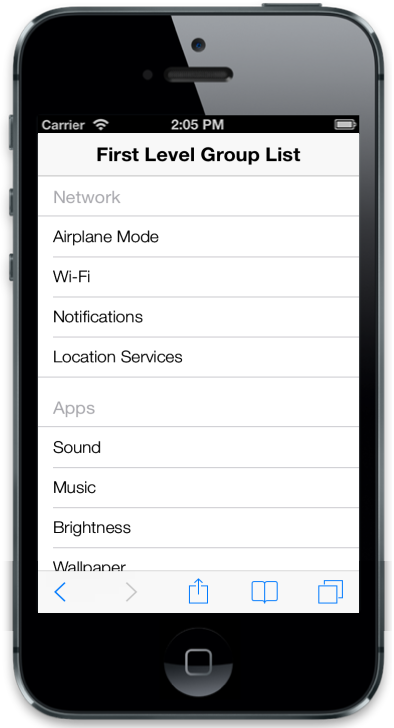
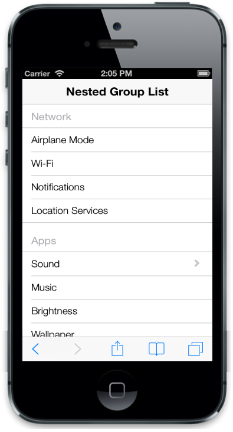

# Grouped List

## First level group list

The ListView widget makes a grouped list when ‘data-ej-enablegrouplist’ attribute is set to true. This groups the set of items listed under ul. The grouped item is identified with the header title specified.



    

        <ul data-ej-grouplisttitle="Network">

            <li data-ej-text="Airplane Mode"></li>

            <li data-ej-text="Wi-Fi"></li>

            <li data-ej-text="Notifications"></li>

            <li data-ej-text="Location Services"></li>

        </ul>

        <ul data-ej-grouplisttitle="Apps">

            <li data-ej-text="Sound"></li>

            <li data-ej-text="Music"></li>

            <li data-ej-text="Brightness"></li>

            <li data-ej-text="Wallpaper"></li>

        </ul>

        <ul data-ej-grouplisttitle="Settings">

            <li data-ej-text="General"></li>

            <li data-ej-text="Brightness"></li>

            <li data-ej-text="Wallpaper"></li>

        </ul>

    



The following screenshot displays the first level group list:

## Nested Child group list

While selecting a list item that is grouped, you can render another set of list items. This is achieved by defining the desired child item list within the list containing ‘PrimaryKeyValue’. This data-ej-primarykey attribute relates the parent child for identifying its appropriate child when clicking on the parent list item.



    

        <ul data-ej-grouplisttitle="Network">

            <li data-ej-text="Airplane Mode"></li>

            <li data-ej-text="Wi-Fi"></li>

            <li data-ej-text="Notifications"></li>

            <li data-ej-text="Location Services"></li>

        </ul>

        <ul data-ej-grouplisttitle="Apps">

            <li data-ej-primarykey="1" data-ej-text="Sound">

                <ul>

                    <li data-ej-text="Ring Tone"></li>

                    <li data-ej-text="Message Tone"></li>

                    <li data-ej-text="Notification Tone"></li>

                </ul>

            </li>

            <li data-ej-text="Brightness"></li>

            <li data-ej-text="Wallpaper"></li>

        </ul>

        <ul data-ej-grouplisttitle="Settings">

            <li data-ej-text="General"></li>

            <li data-ej-text="Brightness"></li>

            <li data-ej-text="Wallpaper"></li>

        </ul>

    



The following screenshot displays the Nested Child Group List:

