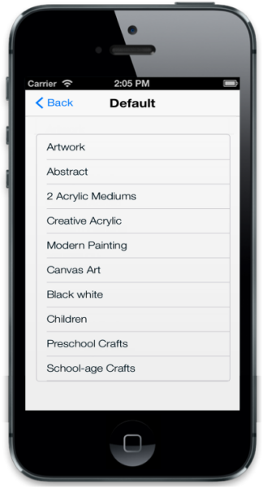

## IOS7 Specific Customization

You can set the IOS7 specific properties to the control by accessing IOS7 property. The data-ej-ios7-inline attribute provides inline appearance for the ListView control and displays the ListView with rounded corners.



<ul>

<li data-ej-text="Artwork"></li>

<li data-ej-text="Abstract"></li>

<li data-ej-text="2 Acrylic Mediums"></li>

<li data-ej-text="Creative Acrylic"></li>

<li data-ej-text="Modern Painting"></li>

<li data-ej-text="Canvas Art"></li>

<li data-ej-text="Black white"></li>

<li data-ej-text="Children"></li>

<li data-ej-text="Preschool Crafts"></li>

<li data-ej-text="School-age Crafts"></li>

</ul>



The following screenshot displays the iOS7 Specific Customization:

{{ '' | markdownify }}
{:.image }

