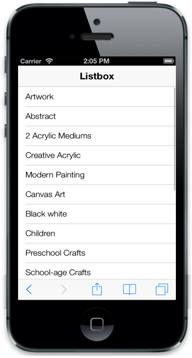
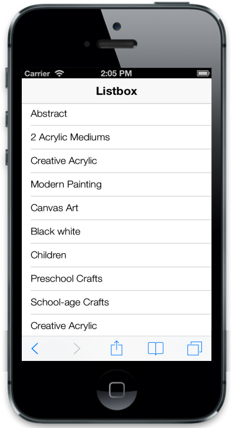
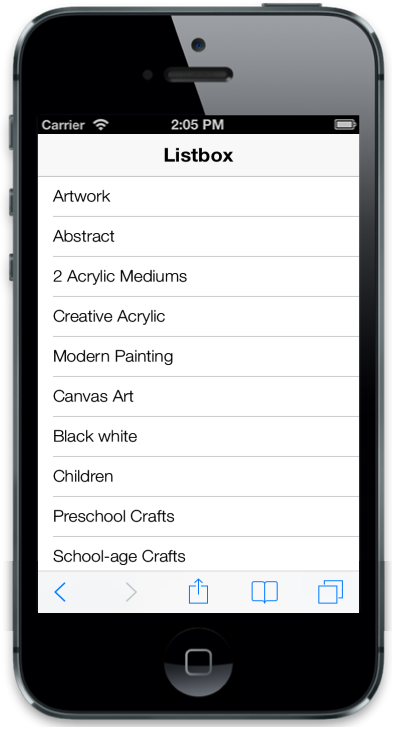

## Scrolling

The data-ej-allowscrolling attribute defines whether to allow the scrolling behavior of the content when it exceeds the target elements’ height.



<ul>

<li data-ej-text="Artwork"></li>

<li data-ej-text="Abstract"></li>

<li data-ej-text="2 Acrylic Mediums"></li>

<li data-ej-text="Creative Acrylic"></li>

<li data-ej-text="Modern Painting"></li>

<li data-ej-text="Canvas Art"></li>

<li data-ej-text="Black white"></li>

<li data-ej-text="Children"></li>

<li data-ej-text="Preschool Crafts"></li>

<li data-ej-text="School-age Crafts"></li>

</ul>



> _Note:_ _Run this code example and you can see the following output. For more details, refer to the "Common Getting Started" section._

{{ '' | markdownify }}
{:.image }

### EnableNativeScrolling

Even though there is inbuilt mobile JS scroll bar in the ListView, it is also possible to use the Native Scroll Bar based on the device it gets rendered. It is done by adding data-ej-enablenativescrolling attribute to the ListView element. 



<ul>

<li data-ej-text="Artwork"></li>

<li data-ej-text="Abstract"></li>

<li data-ej-text="2 Acrylic Mediums"></li>

<li data-ej-text="Creative Acrylic"></li>

<li data-ej-text="Modern Painting"></li>

<li data-ej-text="Canvas Art"></li>

<li data-ej-text="Black white"></li>

<li data-ej-text="Children"></li>

<li data-ej-text="Preschool Crafts"></li>

<li data-ej-text="School-age Crafts"></li>

            <li data-ej-text="Artwork"></li>

<li data-ej-text="Abstract"></li>

<li data-ej-text="2 Acrylic Mediums"></li>

<li data-ej-text="Creative Acrylic"></li>

<li data-ej-text="Modern Painting"></li>

<li data-ej-text="Canvas Art"></li>

<li data-ej-text="Black white"></li>

<li data-ej-text="Children"></li>

<li data-ej-text="Preschool Crafts"></li>

<li data-ej-text="School-age Crafts"></li>

</ul>



### AdjustFixedPosition

data-ej-adjustfixedposition attribute is used to render fixed elements and ListView in the same page. When this attribute is set to true, it automatically calculates and places the ListView without overlaying any element.

The following code example demonstrates how it looks when this attribute is disabled. Default header in the ListView is disabled and a new header is created with Fixed Position. Since the header is fixed, you have to set the data-ej-adjustfixedposition attribute value to true to adjust its content dynamically.



<ul>

<li data-ej-text="Artwork"></li>

<li data-ej-text="Abstract"></li>

<li data-ej-text="2 Acrylic Mediums"></li>

<li data-ej-text="Creative Acrylic"></li>

<li data-ej-text="Modern Painting"></li>

<li data-ej-text="Canvas Art"></li>

<li data-ej-text="Black white"></li>

<li data-ej-text="Children"></li>

<li data-ej-text="Preschool Crafts"></li>

<li data-ej-text="School-age Crafts"></li>

</ul>



The following screenshots display the Adjust Fixed Position:

{{ '' | markdownify }}
{:.image }

_Note: You can see here that the first list item is hidden due to fixed header element._

{{ '' | markdownify }}
{:.image }

### CheckDomChanges

data-ej-checkdomchanges attribute specifies the regular updates for scroll bar in the ListView when new item is dynamically added. When this attribute is enabled, scroll height in the ListView is also adjusted as per the number of items.



<ul>

<li data-ej-text="Artwork"></li>

<li data-ej-text="Abstract"></li>

<li data-ej-text="2 Acrylic Mediums"></li>

<li data-ej-text="Creative Acrylic"></li>

<li data-ej-text="Modern Painting"></li>

<li data-ej-text="Canvas Art"></li>

<li data-ej-text="Black white"></li>

<li data-ej-text="Children"></li>

<li data-ej-text="Preschool Crafts"></li>

<li data-ej-text="School-age Crafts"></li>

</ul>



