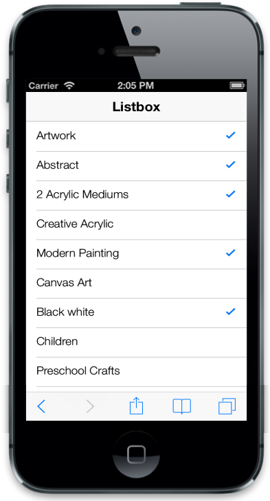
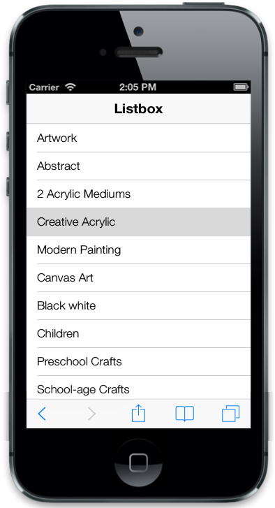

## Selection

### MultiSelection

ListView has a check list feature that is used to select multiple list items at the same time in the ListView. For this, set data-ej-enablecheckmark to true.



<ul>

<li data-ej-text="Artwork"></li>

<li data-ej-text="Abstract"></li>

<li data-ej-text="2 Acrylic Mediums"></li>

<li data-ej-text="Creative Acrylic"></li>

<li data-ej-text="Modern Painting"></li>

<li data-ej-text="Canvas Art"></li>

<li data-ej-text="Black white"></li>

<li data-ej-text="Children"></li>

<li data-ej-text="Preschool Crafts"></li>

<li data-ej-text="School-age Crafts"></li>

</ul>



The following screenshot displays Multiselection:

{{ '' | markdownify }}
{:.image }

### PreventSelection

When a specific list item is selected, it is highlighted with an active color. data-ej-preventselection attribute prevents this behavior when set to true. 

> _Note: When the click (select) action is completed, the highlight is undone automatically even if this attribute is set to false._

> 



<ul>

<li data-ej-text="Artwork"></li>

<li data-ej-text="Abstract"></li>

<li data-ej-text="2 Acrylic Mediums"></li>

<li data-ej-text="Creative Acrylic"></li>

<li data-ej-text="Modern Painting"></li>

<li data-ej-text="Canvas Art"></li>

<li data-ej-text="Black white"></li>

<li data-ej-text="Children"></li>

<li data-ej-text="Preschool Crafts"></li>

<li data-ej-text="School-age Crafts"></li>

</ul>



### PersistSelection

data-ej-persistselection attribute is used to highlight the selected item in the ListView control even after touch end happens. By default, the active state is removed once touch end happens.



<ul>

<li data-ej-text="Artwork"></li>

<li data-ej-text="Abstract"></li>

<li data-ej-text="2 Acrylic Mediums"></li>

<li data-ej-text="Creative Acrylic"></li>

<li data-ej-text="Modern Painting"></li>

<li data-ej-text="Canvas Art"></li>

<li data-ej-text="Black white"></li>

<li data-ej-text="Children"></li>

<li data-ej-text="Preschool Crafts"></li>

<li data-ej-text="School-age Crafts"></li>

</ul>



The following screenshot displays Persist Selection:

{{ '' | markdownify }}
{:.image }

