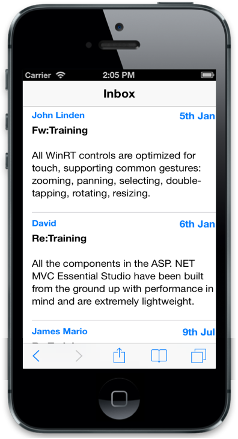

## Templating

### Internal Template

By using template support, you can customize the appearance of the individual list item or render the whole ListView by using a single template. Setting the data-ej-rendertemplate to true and specifying the template inside the li item renders the ListView with template item.



        

            

                
Class}}">

                

                

                    {{>Name}} {{>Designation}}

                    

                        {{>About}}

                

            

        
 



### External template

The data-ej-templateid attribute is used to define the template ID for the list item. Template is defined outside and is rendered by using its ID for list items. The Template ID is set to the data-ej-templatid attribute for the ListView control so that the template renders along with the ListView. To use data-ej-templateid attribute, enable the data-ej-rendertemplate attribute.



        

        <ul>

            <li data-ej-rendertemplate=true data-ej-templateid="target1"></li>

            <li data-ej-rendertemplate=true data-ej-templateid="target2"></li>

            <li data-ej-rendertemplate=true data-ej-templateid="target3"></li>

        </ul>

    

    

        

            

                John Linden

                    5th Jan

                

            

            

                Fw:Training

            

            

                All WinRT controls are optimized for touch, supporting common gestures: zooming, panning, selecting, double-tapping, rotating, resizing.

            

            

            

        

    

    

        

            

                David

                    6th Jan

                

            

            

                Re:Training

            

            

                All the components in the ASP. NET MVC Essential Studio have been built from the ground up with performance in mind and are extremely lightweight.

            

        

    

    

        

            

                James Mario

                    6th Jan

                

            

            

                Re:Training

            

            

                Syncfusion Metro Studio is a collection of over 2500 Metro-style icon templates that can be easily customized to create thousands of unique Metro icons.

            

        

    



You can add the following styles for better appearance.



        .appview .e-m-android .name-panel, .appview .e-m-android .time-panel {

            color: #4DA6C4;

        }

        .appview .e-m-flat .name-panel, .appview .e-m-flat .time-panel {

            color: #F48B22;

        }

        .appview .time-panel {

            float: right;

            color: #007AFF;

            font-weight: bold;

        }

        .appview .content-panel {

            font-size: 14px;

        }

        .appview .name-panel {

            font-size: 15px;

            font-weight: bold;

            color: #007AFF;

            padding-bottom: 5px;

        }

        .appview .message-title {

            font-weight: bold;

            padding-bottom: 5px;

        }

        .appview .text-panel {

            padding-bottom: 5px;

            padding-top: 5px;

        }



The following screenshot displays the Template:

{{ '' | markdownify }}
{:.image }

