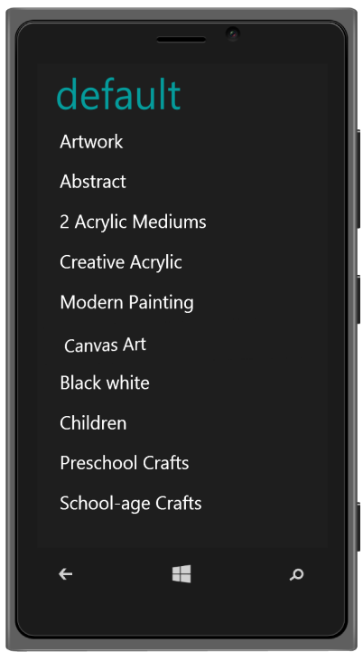

# Windows Specific Customization

You can set the Windows Specific properties to the control by accessing Windows property. data-ej-preventskew attribute is used to disable the skewing effect while clicking on the list item. 



	<ul>

		<li data-ej-text="Artwork"></li>

		<li data-ej-text="Abstract"></li>

		<li data-ej-text="2 Acrylic Mediums"></li>

		<li data-ej-text="Creative Acrylic"></li>

		<li data-ej-text="Modern Painting"></li>

		<li data-ej-text="Canvas Art"></li>

		<li data-ej-text="Black white"></li>

		<li data-ej-text="Children"></li>

		<li data-ej-text="Preschool Crafts"></li>

		<li data-ej-text="School-age Crafts"></li>

	</ul>



The following screenshot displays the Windows Specific Customization:

