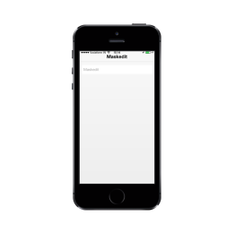

## Border Support

ShowBorder property is used to decide whether the MaskEdit Textbox border can be visible or hidden. The default value is true.

Refer to the following code example.



<input id=" maskedit_sample" data-role="ejmmaskedit" data-ej-showborder="false" data-ej-watermarktext="Maskedit" data-ej-mask="+1 (999) 999-9999" />



{{ '' | markdownify }}
{:.image }

