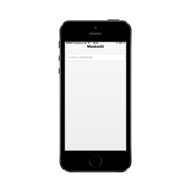

## Customize Watermark text

WatermarkText property is used in customizing the text that appears in the background of your MaskEdit Textbox. It acts like a label for the MaskEdit Textbox.

Refer to the following code example.



<input id="textbox_sample" data-role="ejmmaskedit" data-ej-watermarktext="Custom Maskedit" data-ej-mask="+1 (999) 999-9999" />



{{ '' | markdownify }}
{:.image }

