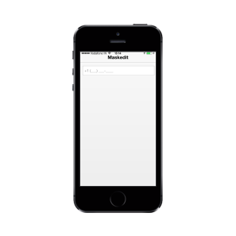

## Masking

It can be done by using the MaskEdit Textbox control. When you define an input mask by using the Mask property, each character position in the Masked Edit control maps to either the place holder of a specified type or a literal character.

Refer to the following code example.



<input id="maskedit_sample" data-role="ejmmaskedit" data-ej-watermarktext="Maskedit" data-ej-mask="+1 (999) 999-9999" />



{{ '' | markdownify }}
{:.image }

