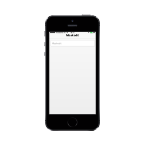

# Read-only Support

When it is set to true, you cannot edit the value in the MaskEdit Textbox. The default value is false.

Refer to the following code example.



<input id="textbox_sample" data-role="ejmmaskedit" data-ej-watermarktext="Maskedit" data-ej-mask=" +1 (999) 999-9999" data-ej-readonly="true" />



