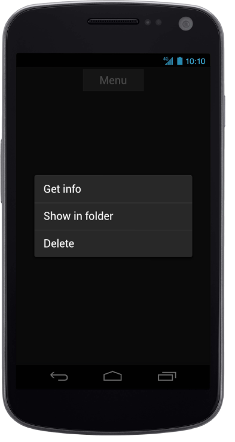

## Android Specific Customization

Set the Android Specific properties to the control by accessing “Android” property.

### Type	

When you click a button or target element, the Menu appears in contextual or popup mode. The appearance of the Menu is defined by data-ej-type attribute. 

The possible values are, 

1. Contextual 
2. Popup
3. Optionmenu
4. Optionslist



        

            <input id="menuitem" type="button" data-role="ejmbutton" data-ej-rendermode="android" data-ej-text="Menu" />

        

        

            <ul>

                <li data-ej-text="Get info"></li>

                <li data-ej-text="Show in folder"></li>

                <li data-ej-text="Delete"></li>

            </ul>



The following screenshot displays the Android-specific Type:

{{ '' | markdownify }}
{:.image }

