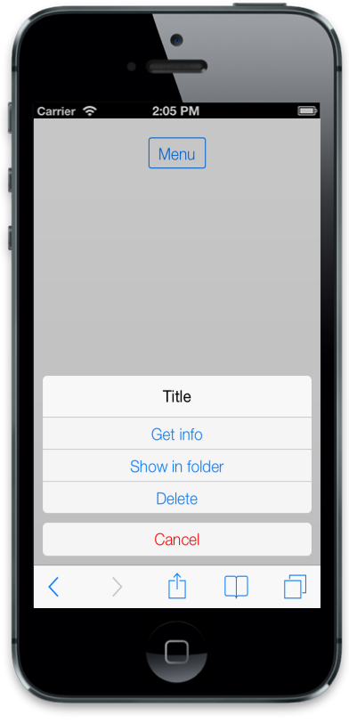
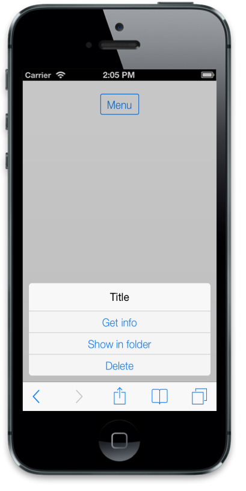
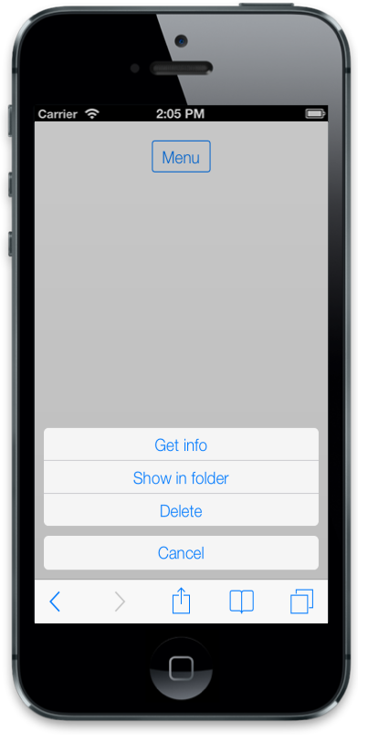
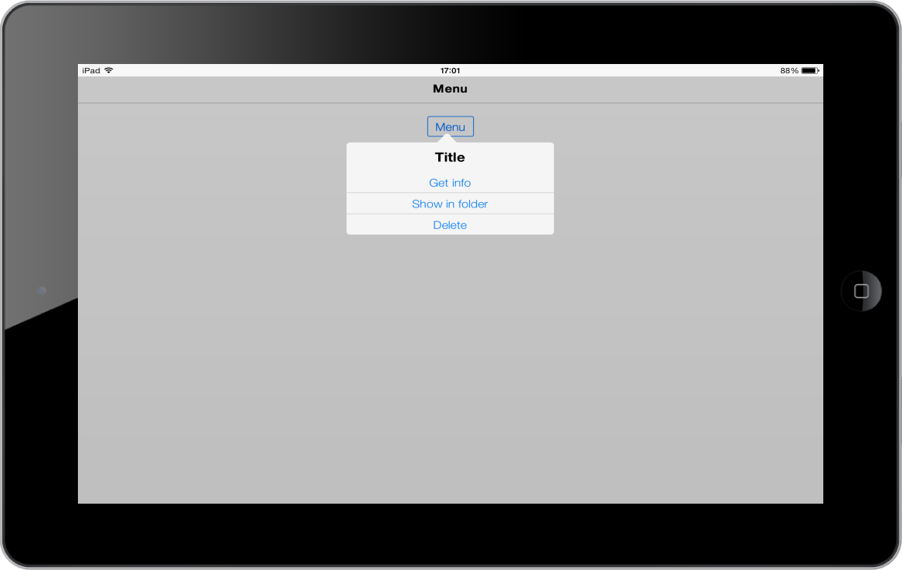

## IOS7 Specific Customization

You can set the iOS7 specific properties to the control by accessing iOS7 property.

### Cancel Button Customization	

#### Text And Color

The iOS7 Animate Type Menu comes with the Cancel Button at the bottom. The Cancel Button color can be customized by data-ej-ios7-cancelbuttoncolor attribute. The Cancel Button text is changed by using the data-ej-ios7-cancelbuttontext attribute. Set the desired text by using this attribute.



        

            <input id="menuitem" type="button" data-role="ejmbutton" data-ej-rendermode="ios7" data-ej-text="Menu" />

        

        

            <ul>

                <li data-ej-text="Get info"></li>

                <li data-ej-text="Show in folder"></li>

                <li data-ej-text="Delete"></li>

            </ul>

        



The following screenshot displays the Button Customization:

{{ '' | markdownify }}
{:.image }

#### Hide Cancel Button	

You can hide or show the Cancel Button by setting false or true to the data-ej-showcancelbutton attribute.



        

            <input id="menuitem" type="button" data-role="ejmbutton" data-ej-rendermode="ios7"

                data-ej-text="Menu" />

        

        

            <ul>

                <li data-ej-text="Get info"></li>

                <li data-ej-text="Show in folder"></li>

                <li data-ej-text="Delete"></li>

            </ul>

        



The following screenshot displays the Show Cancel Button:

{{ '' | markdownify }}
{:.image }

### Title	

When iOS7 Menu is used, it comes up with a Title on the top of the Menu container. You can hide or show the Title by setting false or true by using the data-ej-showtitle attribute. You can also change the Title text by setting the desired Title for data-ej-title attribute.



        

            <input id="menuitem" type="button" data-role="ejmbutton" data-ej-rendermode="ios7"

                data-ej-text="Menu" />

        

        

            <ul>

                <li data-ej-text="Get info"></li>

                <li data-ej-text="Show in folder"></li>

                <li data-ej-text="Delete"></li>

            </ul>

        



The following screenshot displays the Title.

{{ '' | markdownify }}
{:.image }

### Type		

When you click a button or a target element, the Menu is displayed. The appearance of the Menu is defined by the data-ej-type attribute. The possible values are,

1. Animate-This Menu is rendered in phone mode.
2. Normal-This Menu is rendered in tablet mode.
3. Auto-This mode automatically updates the MenuType based on the mode of iOS7 device whether it is phone or tablet mode.



         

            <input id="menuitem" type="button" data-role="ejmbutton" data-ej-rendermode="ios7"

                data-ej-text="Menu" />

        

        

            <ul>

                <li data-ej-text="Get info"></li>

                <li data-ej-text="Show in folder"></li>

                <li data-ej-text="Delete"></li>

            </ul>

        



 The following screenshot displays the Type:

{{ '' | markdownify }}
{:.image }

