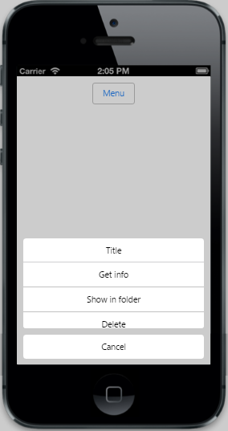

# Scrolling 	

The data-ej-allowscrolling attribute defines whether to allow the scrolling behavior or not when the number of Menu items exceed the specified Menu height. To display the scrollbars when data-ej-allowscrolling is enabled, set the data-ej-showscrollbars attribute to true. You can customize the height and width of the Menu control by setting the desired value to data-ej-height and data-ej-width attributes respectively.



        

            <input id="menuitem" type="button" data-role="ejmbutton" data-ej-text="Menu" />

        

        

            <ul>

                <li data-ej-text="Get info"></li>

                <li data-ej-text="Show in folder"></li>

                <li data-ej-text="Delete"></li>

                <li data-ej-text="Get info"></li>

                <li data-ej-text="Show in folder"></li>

                <li data-ej-text="Delete"></li>

                <li data-ej-text="Get info"></li>

                <li data-ej-text="Show in folder"></li>

                <li data-ej-text="Delete"></li>

            </ul>

        



The following screenshot displays Scrolling:

