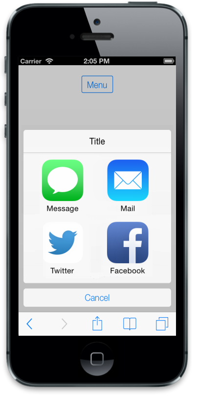

## Templating

### RenderTemplate	

By using the template support, you can customize the appearance of an individual Menu item or the whole Menu is rendered with a single template. Setting the data-ej-rendertemplate to true and specifying the template inside the li item render Menu with template item. Refer to the following code example.



     

            <input id="menuitem" type="button" data-role="ejmbutton" data-ej-text="Menu" />

        

      

        

           
Message

           
Mail

           
Twitter

           
Facebook

        

      



The following screenshot displays the RenderTemplate of Menu.

{  | markdownify }
{:.image }

### TemplateID

This attribute is used to define the Template ID for the Menu item. Template is defined outside and can be rendered by using its ID for Menu items. The template’s ID is set to the data-ej-templateid attribute for the Menu control so that the template renders along with the Menu. To use data-ej-templateid attribute, enable the data-ej-rendertemplate attribute.



       <input id="menuitem" type="button" data-role="ejmbutton" data-ej-text="Menu" /> 

      <ul>

           <li data-ej-text="Get info" data-ej-rendertemplate="true" data-ej-templateid="template1" ></li>

           <li data-ej-text="Show in folder" data-ej-rendertemplate="true" data-ej-templateid="template2"></li>

           <li data-ej-text="Delete" data-ej-rendertemplate="true" data-ej-templateid="template3"></li>

      </ul>

     Insurance

     Premium

     Benefits



