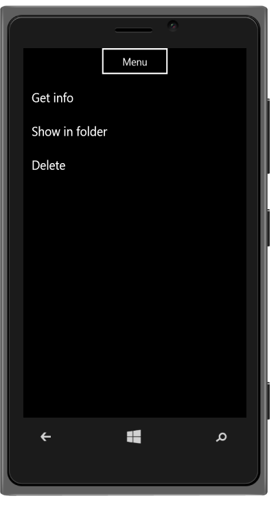

# Windows Specific Customization

You can set the windows specific properties to the control by accessing Windows property.

## Type	

When you click a button or target element, the Menu appears in contextual or popup mode. The appearance of the Menu is defined by the data-ej-type attribute. 

The possible values are,

1. Contextual 
2. Popup



	<input id="menuitem" type="button" data-role="ejmbutton" data-ej-text="Menu" data-ej-rendermode="windows" />

	<ul>

		<li data-ej-text="Get info"></li>

		<li data-ej-text="Show in folder"></li>

		<li data-ej-text="Delete"></li>

	</ul>



The following screenshot displays the Windows-specific Type:

