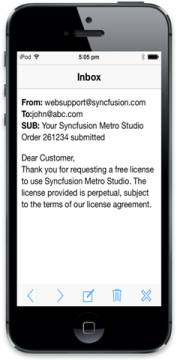

# Getting Started

## Create your first Toolbar in JavaScript

The Essential JavaScript mobile Toolbar provides a single interface to select a command from a collection of commands. It also provides template support. In this example, you can learn how to create a Mail App and through that you can learn the features of Mobile Toolbar Widget.

The Toolbar can also be Mentioned as NavigationBar,Header and Footer.

## Create the necessary layout

The Essential JavaScript Mobile Toolbar Widget is created by using number of <ul> and <li>. Each <li> item performs individual actions. You can customize the Toolbar control by changing its properties according to your requirement. In this scenario, a _back_ toolbar item is used to navigate to previous page, _next_ toolbar item to show the next email in the inbox, _compose_ toolbar item to compose new mail, delete toolbar item to delete current mail, and close toolbar item to close the inbox app. The following steps guide you in creating a basic Toolbar for your application.

Create an HTML file and add the following template to the html file for Toolbar creation.



<!DOCTYPE html>

<html>

	<head>

		<title>Toolbar</title>

		<link href="http://cdn.syncfusion.com/{{ site.releaseversion }}/js/mobile/ej.mobile.all.min.css" rel="stylesheet" />

		

		

		

	</head>

	<body>

		

			

			<!--Add Toolbar Elements here. -->

			

				

					<!--Adding Inbox sample content-->

					

						From: websupport@syncfusion.com 

						To:john@abc.com 

						SUB: Your Syncfusion Metro Studio Order 261234 submitted 

						 

						

							Dear Customer, 

							Thank you for requesting a free license to use Syncfusion Metro Studio. The license provided is perpetual, subject to the terms of our license agreement.

						

					

					<!—Adding dialog control -->

					

						

						

					

				

			

			

		

</html>



Execute this code to render the following output.

