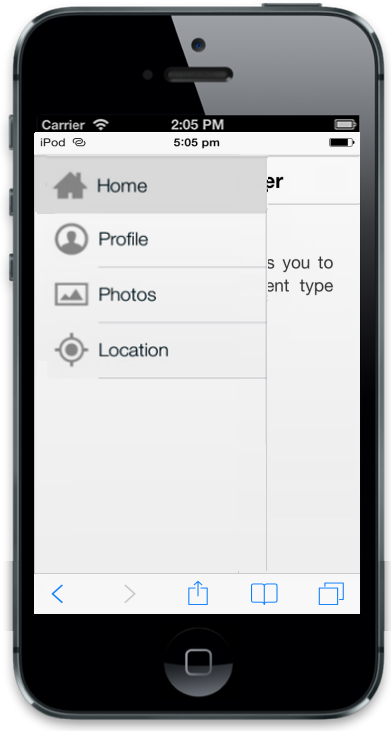

## Customize ListViewSettings

The navigation panel accommodates any template, but most of the use cases requires list view control. So built-in support is provided in Navigation Drawer to render ListView control by setting data-ej-enablelistview attribute as true. You can customize all the features available in ListView. For example you can customize the width of the list view.

Refer to the following code example.



        <ul>

            <li data-ej-imageurl="http://js.syncfusion.com/UG/Mobile/Content/drawer/home.png" data-ej-text="Home"

                id="navhome"></li>

            <li data-ej-imageurl="http://js.syncfusion.com/UG/Mobile/Content/drawer/profile.png" data-ej-text="Profile"

                id="navprofile"></li>

            <li data-ej-imageurl="http://js.syncfusion.com/UG/Mobile/Content/drawer/photo.png" data-ej-text="Photos"

                id="navphotos"></li>

            <li data-ej-imageurl="http://js.syncfusion.com/UG/Mobile/Content/drawer/locations.png" data-ej-text="Location"

                id="navlocation"></li>

        </ul>

    

    

    

        

            The Home screen allows you to choose the specific content type displayed.

        

        

            The Profile page content is displayed.

        

        

            The Photos page content is displayed.

        

        

            The Location page content is displayed.

        

    



Refer to the script section to update the page content while clicking the item in the drawer.

The following screenshot illustrates the output.

{{ '' | markdownify }}
{:.image }

