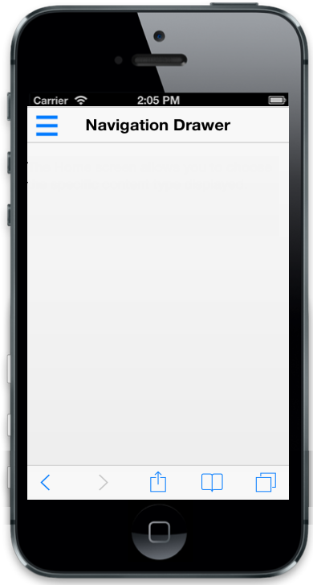
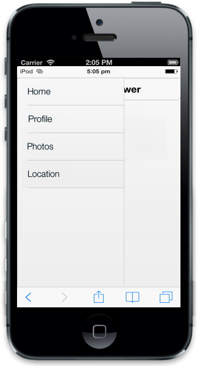
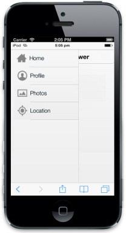

# Getting Started

## Create your first Navigation Drawer control

Essential JavaScript Navigation Drawer is a sliding panel that displays the list of navigation options on demand. That is, by default, it is not visible but you can display it onto the left/right side of the screen by swiping or by clicking with desired target icon. 

The following steps guide you to add a Navigation Drawer control for a mobile application that displays a list of items such as home, profile, photos and location where you can navigate to desired page by clicking on the option available in the drawer. 

### Create basic mobile layout

Create an HTML file and paste the following template for mobile layout.



<!DOCTYPE html>

<html>

	<head>

	    <meta id="viewport" name="viewport" content="width=device-width, initial-scale=1.0,maximum-scale=1.0, user-scalable=no" />

	    <title>Navigation Drawer</title>

	    <link href="[http://cdn.syncfusion.com/13.1.0.21/js/mobile/ej.mobile.all.min.css](http://cdn.syncfusion.com/13.1.0.21/js/mobile/ej.mobile.all.min.css)" rel="stylesheet" />

		                

		

		

		 

	</head>

	<body>

	    <div data-role="appview">

	        <!-- Adding Header Control Here -->

	        <!-- Adding Navigation Drawer Control here -->

	    

	</body>

</html>



### Add Header control for Navigation Drawer

To render the Header control, set “data-role” attribute to “ejmheader” to a div element. To set header title you can use “data-ej-title” attribute with desired title.



<!-- Adding Header Control Here -->

<div id="header" data-role="ejmheader" data-ej-position="normal" data-ej-title="Navigation Drawer" data-ej-showleftbutton="true" data-ej-leftbuttonimageclass="icon-target">



### Add Navigation Drawer control

To add Navigation Drawer control, specify ejmnavigationdrawer as data-role attribute for a 
 element. You can display a navigable option as a list by using listview. To achieve this, set the attribute data-ej-enablelistview as true in navigation drawer wrapper element. You can set thetext for list itemsby using data-ej-text attribute.



<!-- Adding Navigation Drawer Control here -->

	<ul>

		<li data-ej-text="Home"></li>

		<li data-ej-text="Profile"></li>

		<li data-ej-text="Photos"></li>

		<li data-ej-text="Location"></li>

	</ul>



### Add target element to display the drawer

You can display the drawer by clicking target icon. To achieve this, set the target element’s id with ‘data-ej-targetid’ attribute of the navigation drawer wrapper element.



<!-- Adding Navigation Drawer Control here -->

<div data-role="ejmnavigationdrawer" id="navpane" data-ej-enablelistview="true" data-ej-targetid="target_leftbutton">

   <ul>

      <li data-ej-text="Home"></li>

      <li data-ej-text="Profile"></li>

      <li data-ej-text="Photos"></li>

      <li data-ej-text="Location"></li>

   </ul>



To set the target icon image from sprite and to position the target icon properly, use the following styles.



[class*="icon-"] {

	background-image: url("http://js.syncfusion.com/ug/mobile/content/drawer/sprite.png");

}

#content .e-m-list-container {

	padding: 20px;

	background: transparent;

}

.e-m-btnwrapper.e-m-btn-image .e-m-btn-tag.icon-target {

	background-position: -4px -345px;

	background-size: auto auto;

}



Run the above code to render the following output. 

You can display the drawer by either clicking on the target icon or else by swiping from left. Refer to the following screenshot.

### Add images for Navigation Drawer

You can set the images for Navigation Drawer by using data-ej-imageclass attribute in the inner list elements.



<!-- Adding Navigation Drawer Control here -->

<div data-role="ejmnavigationdrawer" id="navpane" data-ej-enablelistview="true" data-ej-targetid="header_leftbutton">

   <ul>

      <li data-ej-imageclass="icon-home" data-ej-text="Home"></li>

      <li data-ej-imageclass="icon-profile" data-ej-text="Profile"></li>

      <li data-ej-imageclass="icon-photo" data-ej-text="Photos"></li>

      <li data-ej-imageclass="icon-locations" data-ej-text="Location"></li>

   </ul>



You can define the image classes specified for the list items as follows.



#navpane [class*="icon-"]

{

	width: 35px;

	height: 35px;

}

.icon-home

{

	background-position: 0 0;

}

.icon-profile

{

	background-position: 0 -253px;

}

.icon-photo

{

	background-position: 0 -168px;

}

.icon-locations

{

	background-position: 0 -85px;

}    



Run the above code to render the following output. 

### Load appropriate content while selection

You can load the desired content for the navigation items by updating the content through touch end handler of listview. Also to know which item’s content is being loaded in the page you can make the list selection to persist in the drawer by setting ‘data-ej-listviewsettings-persistselection’ attribute as true.

Refer to the following code examples.



<!-- Adding Navigation Drawer Control here -->

<div data-role="ejmnavigationdrawer" id="navpane" data-ej-enablelistview="true" data-ej-listviewsettings persistselection="true" data-ej-targetid="header_leftbutton" data-ej-contentid="content">

	<ul>

		<li data-ej-imageclass="icon-home" data-ej-text="Home"></li>

		<li data-ej-imageclass="icon-profile" data-ej-text="Profile"></li>

		<li data-ej-imageclass="icon-photo" data-ej-text="Photos"></li>

		<li data-ej-imageclass="icon-locations" data-ej-text="Location"></li>

	</ul>



While clicking the navigation options it loads appropriate content into the current page. You can achieve this by setting some sample content to load on selecting the items. Refer to the following code examples.



<!-- Adding the Navigation Drawer page content-->

      <!-- Home Page Content-->

        <div id="content">

            <div id="Home">

                The Home screen allows you to choose the specific content type displayed.

            

            <!-- Profile Page Content-->

            <div id="Profile">

                The Profile page content is displayed.

            

            <!-- Photos Page Content-->

            <div id="Photos">

                The Photos page content is displayed.

            

            <!-- Location Page Content-->

            <div id="Location">

                The Location page content is displayed.

            

        



Add the following code example to display the first listitem content while rendering.



$(function () {

	var instance = ej.getCurrentPage().find("#navpane_listview").ejmListView("instance");

	instance.selectItem(0);

});



Run the above code to render the following output.

