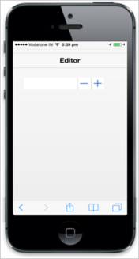

# Border Support

The ShowBorder property is used to specify whether Textbox border is visible or hidden.



<input type="number" id="textbox_sample" data-role="ejmnumeric" data-ej-showBorder="false" />



The following screenshot displays the output.

