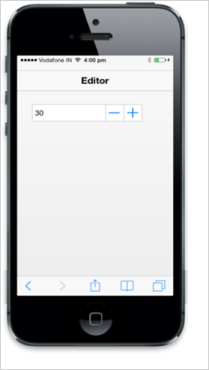

## Customize value

The current value of the Numeric Textbox can be specified by using the Value property. The range for the Numeric Textbox can be specified by using the MaxValue and MinValue properties. The Numeric Textbox can only accept values within those specified range. The IncrementStep property is used to set the step value in each incrementing or decrementing textbox when the spin buttons are clicked or up/down arrows are used.



<input type="number" id="textbox_sample" data-role="ejmnumeric" data-ej-value="30"data-ej-incrementstep="2" data-ej-maxvalue=100 data-ej-minvalue=3 />



The following screenshot displays the output.

{{ '' | markdownify }}
{:.image }

The DecimalPlaces property makes you restrict the decimal places to set the decimal (floating point) numbers.



<input type="number" id="textbox_sample" data-role="ejmnumeric" data-ej-decimalPlaces="3"/>



