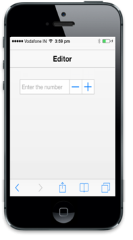

## Customize Watermark Text

The WatermarkText property is used to define the watermark text in the control, that is, it acts like a label for the Textbox. This text appears in the background of the Numeric Textbox.



<input type="number" id="textbox_sample" data-role="ejmnumeric" data-ej-watermarktext="Enter the number" /> 



The following screenshot displays the output.

{{ '' | markdownify }}
{:.image }

