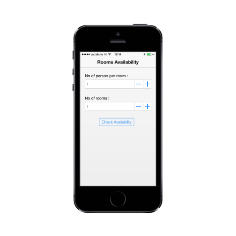

# Getting Started

## Create your first Numeric Textbox in JavaScript

The following is an example for Rooms Availability Check and it describes how simple it is to create the first layout of Numeric Textbox and how efficient it is to use the features of the control.

### Create the required layout

You can render the Numeric Textbox control based on the default values for all the properties. You can easily customize Numeric Textbox control by changing its properties according to your requirements.

Create an HTML file and add the following template to the HTML file for Rooms availability check form creation.



<!DOCTYPE html>

<html>

<head>

    <meta id="viewport" name="viewport" content="width=device-width, initial-scale=1.0,maximum-scale=1.0, user-scalable=no" />

    <title>Rooms Availability Check</title>

    <link href="[http://cdn.syncfusion.com/13.1.0.21/js/mobile/ej.mobile.all.min.css](http://cdn.syncfusion.com/13.1.0.21/js/mobile/ej.mobile.all.min.css)" rel="stylesheet" />

    

    

    

    

    

</head>

<body>

    <!--Page Header-->

    

    

        

				<!--Numeric TextBox 1 code here-->

                <!--Numeric TextBox 2 code here-->

            

                <input data-role="ejmbutton" data-ej-text="Check Availability" type="button" id="but_submit"/>

            

        

    
    

</body>

</html>



To render Numeric Textbox control, specify ejmnumeric as the date-role attribute for an <input> element and type the attribute as number. Add the following code example to render numeric textbox to input the number of persons per room.



<!--Numeric TextBox 1 code-->

   <label>No of person per room :</label>

   <input data-role="ejmnumeric" data-ej-watermarktext="1" data-ej-showspinbutton="true" data-ej-minvalue="1" data-ej-maxvalue="6" type="number" name="person" id="persontext" />



Add the following code example to render the Numeric Textbox to input number of rooms needed.



<!--Numeric TextBox 2 code-->

   <label>No of rooms :</label>

   <input data-role="ejmnumeric" data-ej-watermarktext="1" data-ej-showspinbutton="true" data-ej-minvalue="1" data-ej-maxvalue="5" type="number" name="rooms" id="roomstxt" />



To improve the look and feel of Rooms Availability Check you need to add the following code example in your application.



        .content_area {

            margin-top: 45px;

            padding: 20px;

        }

        .content {

            max-width: 480px;

            margin: 0 auto;

        }

        .text_row {

            margin-top: 25px;

        }

        .button_cnt {

            width: 160px;

            margin-left: auto;

            margin-right: auto;

        }



