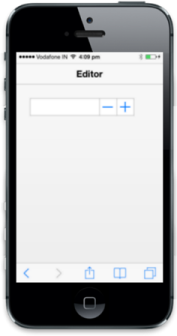

# ReadOnly Support

The ReadOnly property is used to enable or disable the value changes in the Textbox. 



<input type="number" id="textbox_sample" data-role="ejmnumeric"  data-ej-readOnly="false"/>  



The following screenshot displays the output.

