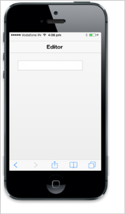

# Spin Buttons

The ShowSpinButton property is used to specify whether the Spin Button is visible or hidden. By clicking these buttons, you can increment or decrement the numeric value.



<input type="number" id="textbox_sample" data-role="ejmnumeric" data-ej-showSpinButton="false"/>



The following screenshot displays the output.

