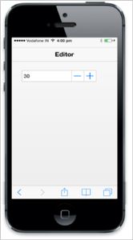

## Strict Mode Support

The EnableStrictMode property makes Textbox accept only a value between the defined maximum and minimum values when it is set to “True”.



<input type="number" id="textbox_sample" data-role="ejmnumeric" data-ej-minvalue=30 data-ej-maxvalue=100 data-ej-enablestrictmode="true" />



The following screenshot displays the output.

{  | markdownify }
{:.image }

