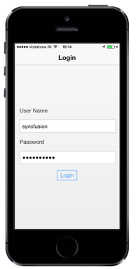
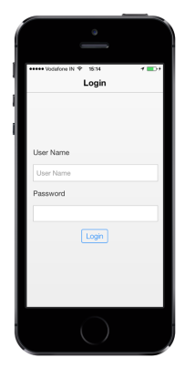
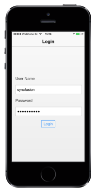

# Getting Started

## Create your first Password Textbox in JavaScript

Using the given guidelines, you can create a basic login form using the Password Textbox control.

### Create Password Textbox

Create an HTML file and add the following template to the HTML file.



<!DOCTYPE html>

<html>

<head>

    <title>Password</title>

<meta name="viewport" content="width=device-width, initial-scale=1.0,maximum-scale=1.0, user-scalable=no" />

    <link href="[http://cdn.syncfusion.com/13.1.0.21/js/mobile/ej.mobile.all.min.css](http://cdn.syncfusion.com/13.1.0.21/js/mobile/ej.mobile.all.min.css)" rel="stylesheet" />

    

    

    

</head>

<body>

    

        

            <form id="loginForm">

                <label>

                    User Name

                </label>

                

                    <input id="userName" name="userName" data-role="ejmtextbox" data-ej-watermarktext="User Name" />                    

                

                <label>

                    Password

                </label>

                <!-- Add Password elements here -->

                

                    <input id="submit" name="submit" data-role="ejmbutton" data-ej-text="Login" type="button" />

                

            </form>

        

    

    

</body>
</html>



To render the Password control, you can set “ejmpassword” to the data-role attribute for the specific input element as follows.                                   



<!-- Password elements -->

<input name="password" id="password" data-role="ejmpassword" />



 Add the following styles to show the Password control in an order.



        .error {

            color: red;

        }

        .sample {

            display: table;

            width: 100%;

        }

        .submit {

            text-align: center;

        }

        form {

            padding: 15px;

        }

        .container {

            display: table-cell;

            vertical-align: middle;

        }



Run the above code example and you can see the following output.

## Set Watermark text

The watermark text is usually a short hint that describes the expected value of the input field. This can be achieved by using the “data-ej-watermarktext” attribute.



<input name="password" id="password" data-role="ejmpassword" data-ej-watermarktext="Password" />



Run the above code example and you can see the following output.

