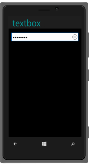

## Windows Specific Customization

The AllowReset property is used to reset the password value in Windows rendermode. The default value is “True”.

Refer to the following code example.



<input id="password_sample" data-role="ejmpassword" data-ej-watermarktext="Password" data-ej-rendermode="windows" data-ej-windows-allowreset="true">



{{ '' | markdownify }}
{:.image }

