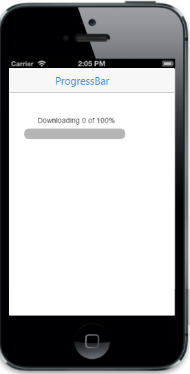

# Customize dimensions

By setting an integer value to data-ej-height attribute, you can change the height of the ProgressBar. The width of the ProgressBar is changed by using data-ej-width attribute. You can refer to the following code examples.





Output of Customize value:

