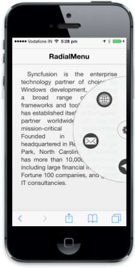

## Dimensions

You can customize Radial Menu width (radius) by using data-ej-radius attribute and its position by using data-ej-position attribute.

The Possible values for Position property are

* Leftcenter
* Lefttop
* Leftbottom
* Rightcenter   
* Righttop
* Rightbottom



  

        <ul>

            <li data-ej-imageurl="http://js.syncfusion.com/UG/Mobile/Content/radial/ios7/light/social.png">

            </li>

            <li data-ej-imageurl="http://js.syncfusion.com/UG/Mobile/Content/radial/ios7/light/music.png">

            </li>

            <li data-ej-imageurl="http://js.syncfusion.com/UG/Mobile/Content/radial/ios7/light/direction.png">

            </li>

            <li data-ej-imageurl="http://js.syncfusion.com/UG/Mobile/Content/radial/ios7/light/message.png">

            </li>

            <li data-ej-imageurl="http://js.syncfusion.com/UG/Mobile/Content/radial/ios7/light/browser.png">

            </li>

        </ul>

    



Refer the following code examples for css class



        .imageclass {

            background: url("http://js.syncfusion.com/UG/Mobile/Content/radial/radialSettings.png");

            background-position: center;

            background-repeat: no-repeat;

        }



Refer the following code examples for script section



        function click(e) {

            $("#radialmenu_sample").ejmRadialMenu("menuHide");

        }



The following screenshot illustrates the output of the above code.

{  | markdownify }
{:.image }

