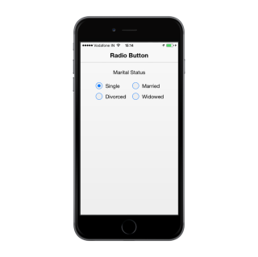

## Checked Status

You have options to set the state of the RadioButton either as checked or unchecked. When you select any one option, a dot mark appears inside the circle. This is called the checkedstate. RadioButtons selected earlier are unselected that is they are in unchecked state. The checked property is used to set the state of the RadioButton.



  

             

            

                

                    <b>Marital Status</b>

                

            

             

            <table border="0" cellpadding="5">

                <tr>

                    <td width="100px">

                        <input type="radio" name="radbtn" data-role="ejmradiobutton" data-ej-text="Single" data-ej-checked="true" />

                    </td>

                    <td>

                        <input type="radio" name="radbtn" data-role="ejmradiobutton" data-ej-text="Married" />

                    </td>

                </tr>

                <tr>

                    <td>

                        <input type="radio" name="radbtn" data-role="ejmradiobutton" data-ej-text="Divorced" />

                    </td>

                    <td>

                        <input type="radio" name="radbtn" data-role="ejmradiobutton" data-ej-text="Widowed" />

                    </td>

                </tr>

            </table>

            

            

        



The following screenshot displays the checkedstatus:

{{ '' | markdownify }}
{:.image }

