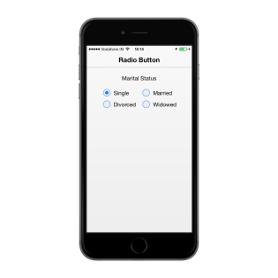

# Customize Label

Specifies the text content for the RadioButton. In previous programs, separate labels are created for each RadioButton. Now, you can set the text for the RadioButton by using the text property. So, here you do not have to add label tag for each RadioButton in the HTML code.



	 
	
	

	
		

			<b>Marital Status</b>

		

	

	 

	<table border="0" cellpadding="5">

		<tr>
		
			<td width="100px">

				<input type="radio" name="radbtn" data-role="ejmradiobutton" data-ej-text="Single" />

			</td>

			<td>

				<input name="radbtn" type="radio" data-role="ejmradiobutton" data-ej-text="Married"  />

			</td>

		</tr>

		<tr>
		
			<td>
			
				<input name="radbtn" type="radio" data-role="ejmradiobutton" data-ej-text="Divorced" />

			</td>

			<td>
			
				<input name="radbtn" type="radio" data-role="ejmradiobutton" data-ej-text="Widowed" />

			</td>

		</tr>

	</table>

	

	



The following screenshot displays the customized labels in the RadioButton.

