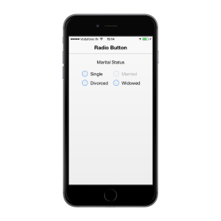

## Enabled

This is a Boolean property that lets you enable or disable the options. When set to false, this prevents you from selecting that particular choice. By default, this property is set to true.



       

             

            

                

                    <b>Marital Status</b>

                

            

             

            <table border="0" cellpadding="5">

                <tr>

                    <td width="100px">

                        <input type="radio" name="radbtn" data-role="ejmradiobutton" data-ej-text="Single" />

                    </td>

                    <td width="100px">

                        <input name="radbtn" type="radio" data-role="ejmradiobutton" data-ej-text="Married" data-ej-enabled="false" />

                    </td>

                </tr>

                <tr>

                    <td width="100px">

                        <input name="radbtn" type="radio" data-role="ejmradiobutton" data-ej-text="Divorced" />

                    </td>

                    <td width="100px">

                        <input name="radbtn" type="radio" data-role="ejmradiobutton" data-ej-text="Widowed" />

                    </td>

                </tr>

            </table>

            

            

        



The following screenshot displays the disabled RadioButton.

{{ '' | markdownify }}
{:.image }

