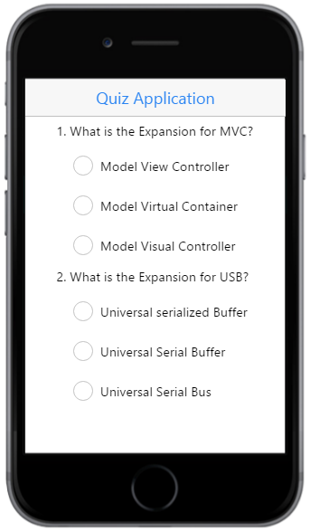

# Getting Started

The following guidelines show you how to use the RadioButton to select the answers in the application and get the selected items. The following screenshot displays a sample Quiz application.

## Create the necessary layout

Create an HTML file and paste the following template to the HTML file for the RadioButton creation.



<!DOCTYPE html>

<html>

<head>

    <meta name="viewport" content="width=device-width, initial-scale=1.0,maximum-scale=1.0, user-scalable=no" />

    <title>RadioButton</title>

    <link href="[http://cdn.syncfusion.com/13.1.0.21/js/mobile/ej.mobile.all.min.css](http://cdn.syncfusion.com/13.1.0.21/js/mobile/ej.mobile.all.min.css)" rel="stylesheet" />

    

    

    

    

    

</head>

<body>

    

        <!-- Header control here-->

        

        

            

                <!--RadioButton content here-->

            

        

<!-- ScrollPanel control here-->

    

   

</body>

</html>



## Create RadioButton

To render the RadioButton control, set data-role attribute to ejmradiobutton to an input element and type attribute as radio.

Add the following code example to render the RadioButton in the quiz application.



<!--RadioButton content-->

<table border="0" cellpadding="5">

    <tr>

        <td>1. What is the Expansion for MVC?

        </td>

     </tr>

      <tr>

         <td class="align">

              <input id="Radio1" name="radbtn" type="radio" data-role="ejmradiobutton" data-ej-text="Model View Controller" />

          </td>

       </tr>

        <tr>

            <td class="align">

                 <input id="Radio2" name="radbtn" type="radio" data-role="ejmradiobutton" data-ej-text="Model Virtual Container" />

             </td>

         </tr>

          <tr>

             <td class="align">

                  <input id="Radio3" name="radbtn" type="radio" data-role="ejmradiobutton" data-ej-text="Model Visual Controller" />

             </td>

          </tr>

            <tr>

               <td>2. What is the Expansion for USB?

                </td>

            </tr>

             <tr>

                 <td class="align">

                      <input id="Radio4" name="USB" type="radio" data-role="ejmradiobutton" data-ej-text="Universal serialized Buffer" />

                  </td>

             </tr>

              <tr>

                 <td class="align">

                       <input id="Radio5" name="USB" type="radio" data-role="ejmradiobutton" data-ej-text="Universal Serial Buffer" />

                      </td>

                  </tr>

                   <tr>

                       <td class="align">

                           <input id="Radio6" name="USB" type="radio" data-role="ejmradiobutton" data-ej-text="Universal Serial Bus" />

                        </td>

                    </tr>

                </table>



Now, add the following style to align the RadioButton and contents properly in the quiz application



        td {

            padding: 5px;

        }

            td.align {

                padding-left: 20px;

            }



The following screenshot is the output for the above code examples.

