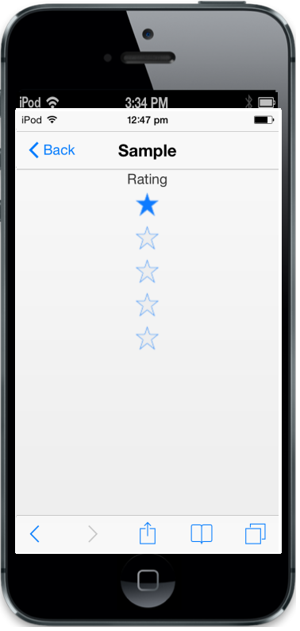

## Customize Orientation

Customize Orientation specifies the display orientation. It can be,

1. Horizontal.
2. Vertical. 



    

    



The following screenshot displays the output.                        

{{ '' | markdownify }}
{:.image }

