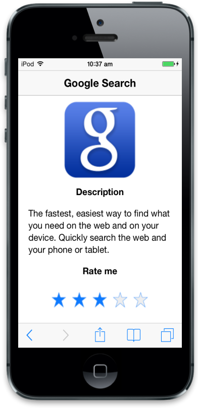

# Getting Started

Essential JavaScript Rating control for Mobile provides an intuitive Rating experience that allows you to select a number of stars that represent a Rating.

{  | markdownify }
{:.image }

## Create the necessary layout

The following steps guide you to add a Rating control for a mobile application Rating scenario, that uses Rating control to rate Google Search Mobile App.

Create an HTML file and paste the following template to the HTML file to add Rating control.



<!DOCTYPE html>

<html>

<head>

<meta id="viewport" name="viewport" content="width=device-width, initial-scale=1.0,maximum-scale=1.0, user-scalable=no" />

<title>Rating</title>

<link href="[http://cdn.syncfusion.com/13.1.0.21/js/mobile/ej.mobile.all.min.css](http://cdn.syncfusion.com/13.1.0.21/js/mobile/ej.mobile.all.min.css)" rel="stylesheet" />

                

  

</head>

<body>

<div data-role="appview">

<!-- Header control -->

<div id="header" data-ej-title="Google Search" data-ej-position="normal" 
             data-role="ejmheader">

           <div id="content">

            <div align="center" id="form" style="padding: 10px;>

      <div id="image"><!—to display the google image -->

                

                 <div style="padding: 0 20px;">

                    <h2>

                        Description

                    </h2>

                    <br />

                    The fastest, easiest way to find what you need on the web and on your device. Quickly

                    search the web and your phone or tablet.

                    <br />

                    <br />

                    <h2>

                        Rate me

                    </h2>

                

 <!--Add Rating control here-->

                 

        <!-- Scroll panel -->
        <div data-role="ejmscrollpanel" data-ej-target="content">

</body>

</html>



## Add Rating control

To add Rating control, you need to specify ejmrating to data-role attribute for a &lt;div&gt; element. Initially Mobile Rating control is rendered with default values of all properties, and it can be easily customized by changing their properties according to your requirements. Refer the following code example.



<!--Rating control--> 



Add the following styles to display the image. 



<!--Adds styles to display google image-->

        #image

        {

            background: url("http://js.syncfusion.com/UG/Mobile/Content/google.png") no-repeat;

            height: 140px;

            width: 140px;

            margin-top:50px;

        }

         #form h2 {

            font-weight: bold;

        }



Run the above code example and rate the application by selecting stars. You will see the following output.

{  | markdownify }
{:.image }

## Set Precision

You can customize the Rating Precision based on your requirement. You can customize Rating Precision by using the data-ej-precision attribute. Set this property to rate more precisely. The Rating control supports three precision modes - Full, Half, and Exact. In Full Precision, you can rate the item with complete precision, like 1 or 2. In Half Precision, you can rate the item with half precision, like 1.5 or 2.5, instead of complete precision. In Exact Precision, you can rate the item with exact precision, like 3.2 or 4.6. For the following example, you need Exact Precision, so we set Exact as the Precision mode.





{  | markdownify }
{:.image }

From the above steps, you have learnt how to add a Mobile Rating control widget using JavaScript for your application Rating scenario. There are more customization properties other than the one used here.

