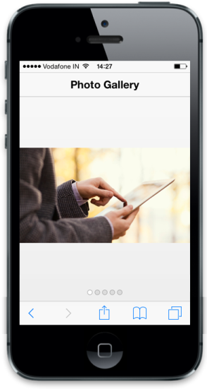

# Customize header

In Rotator you can enable the built-in header support.

To show or hide the header in Rotator, you can use data-ej-showheader attribute. You can set the title for header using data-ej-headerTitle attribute. Refer to the following code example.



   

	

	

		

		

	

	

		

		

	

	

		

		

	

	

		

		

	

	

		

		

	



