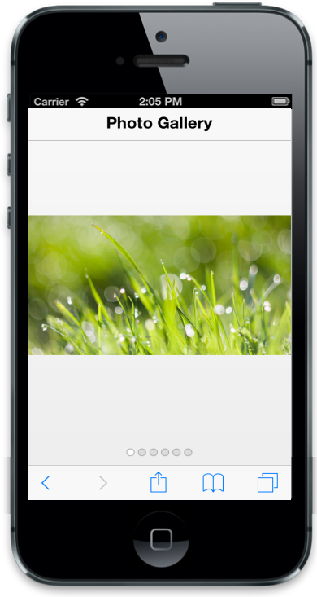
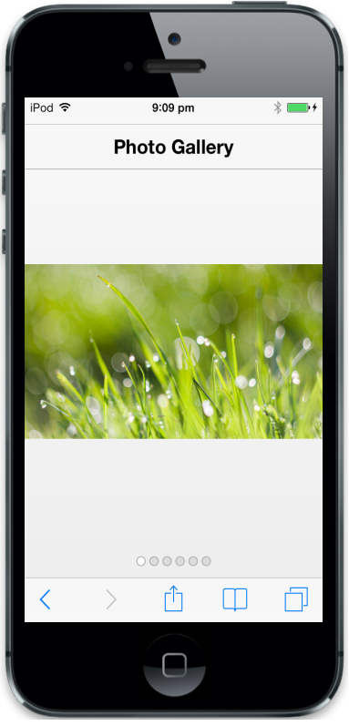
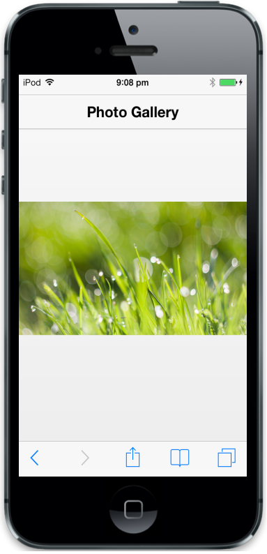
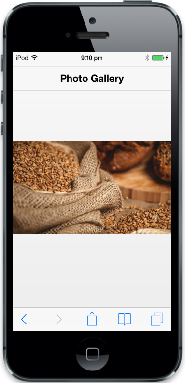

# Getting Started

In this section, you can learn how to create Rotator for your mobile app.

## Create your first Rotator in JavaScript

The Essential JavaScript Mobile Rotator widget is a container (that holds many items) with that you can navigate next and previous items through swipe gestures. Each item in rotator can hold any HTML content. In the following guideline, you can learn the features in mobile rotator widget by creating a Photo Gallery App.

## Create the required layout

Rotator control is rendered based on the default values for all the properties. You can easily customize Rotator control by changing its properties according to your application requirement. The following steps guide you in creating a Photo Gallery App using Rotator.

Create an HTML file and paste the following template to it for Photo Gallery App creation.



<!DOCTYPE html>

<html>

	<head>

		<title>Rotator</title>

		<link href="[http://cdn.syncfusion.com/13.1.0.21/js/mobile/ej.mobile.all.min.css](http://cdn.syncfusion.com/13.1.0.21/js/mobile/ej.mobile.all.min.css)" rel="stylesheet" />

		

		

		

		

	</head>

	<body>

		

			<!-- header control -->

			

			

			

				

					<!--Add Rotator Element here-->

				

			

		

	</body>

</html>



## Create the Rotator control

To render the Rotator control, set “data-role” attribute to “ejmrotator” to a div element. Also set “data-ej-targetid” attribute with the id of the target element that contains the HTML template for each item. Each first level child div element of the target element acts as an item of Rotator. 



    

	
<!—  child 1 -->

		

		

	

<!—  child 2 -->

		

		

	

<!—  child 3 -->

		

		

	

<!—  child 4 -->

		

		

	

<!—  child 5 -->

		

		

	

	



Use the following styles to style the Rotator items.



.photo {

	background-position: center center;

	background-repeat: no-repeat;

	height: 100%;

	width: 100%;

	background-size:contain;

}

.photo1 {

	background-image: url(http://js.syncfusion.com/UG/Mobile/Content/rotator/tablet.jpg);

}

.photo2 {

	background-image: url(http://js.syncfusion.com/UG/Mobile/Content/rotator/rose.jpg);

}

.photo3 {

	background-image: url(http://js.syncfusion.com/UG/Mobile/Content/rotator/green.jpg);

}

.photo4 {

	background-image: url(http://js.syncfusion.com/UG/Mobile/Content/rotator/nature.jpg);

}

.photo5 {

	background-image: url(http://js.syncfusion.com/UG/Mobile/Content/rotator/snowfall.jpg);

}

#content{

   height:500px;

   width:300px;

   margin:auto;

}   



Run this code to render the following output. For more details, refer "Common Getting started” section.

## Hide the Pager

You can see in the above image, the pager is to indicate the item that is currently displayed. You don’t need to show the pager in our use case. To achieve this, make “data-ej-showpager” attribute value as false.





Run this to render the following output. For more details, refer "Common Getting Started" section. 

By swiping left and right, you can view next images from the Photo Gallery.

