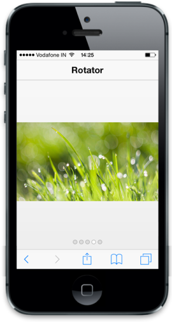

# Select Item

Rotator control takes a numeric value given in data-ej-currentitemindex attribute and displays the corresponding item that matches the given index. Refer to the following code example.



    

        <!-- header control -->

        

        
   

        

        

    

    

        

            

            

        

        

            

            

        

        

            

            

        

        

            

            

        

        

            

            

        

    



