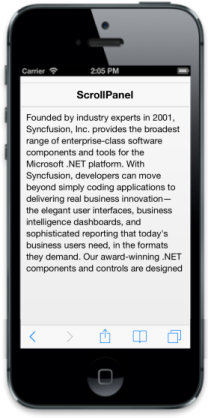

# Customize dimensions

## Scroll height and width

The “data-ej-scrollheight” and “data-ej-scrollwidth” attributes allow you to specify the height and width of the scrollable content respectively. In some cases, some part of the scrollable content may be hidden due to some fixed elements (other than ejm elements). To avoid this, manually set the scrollable content’s height or width.



    

    

        

            Founded by industry experts in 2001, Syncfusion, Inc. provides the broadest range of enterprise-class software components and tools for the Microsoft .NET platform. With Syncfusion, developers can move beyond simply coding applications to delivering real business innovation—the elegant user interfaces, business intelligence dashboards, and sophisticated reporting that today's business users need, in the formats they demand. Our award-winning .NET components and controls are designed to meet your evolving development needs, whether you're working in Windows Forms, WPF, ASP.NET, ASP.NET MVC, or Silverlight. At Syncfusion, we uncompromisingly strive for excellence in order to offer the very best value to our customers—from small ISVs to Fortune 100 companies. Our most successful product is Essential Studio.

        

    

    



The following screenshot displays the scroll height:

## Auto adjust scroll height

The “data-ej-adjustfixedposition” is a boolean attribute that lets you adjust the scrolling content’s height automatically in case there are "ejm" elements with fixed position in your application. By default, the property is set to true.



    

        

            <!--Scroll Content Here-->

            Founded by industry experts in 2001, Syncfusion, Inc. provides the broadest range of enterprise-class software components and tools for the Microsoft .NET platform. With Syncfusion, developers can move beyond simply coding applications to delivering real business innovation—the elegant user interfaces, business intelligence dashboards, and sophisticated reporting that today's business users need, in the formats they demand. Our award-winning .NET components and controls are designed to meet your evolving development needs, whether you're working in Windows Forms, WPF, ASP.NET, ASP.NET MVC, or Silverlight. At Syncfusion, we uncompromisingly strive for excellence in order to offer the very best value to our customers—from small ISVs to Fortune 100 companies. Our most successful product is Essential Studio.

        

    
 

        



The following screenshot displays the auto adjust scroll height:

## Auto height

When the “data-ej-autoadjustheight” attribute is set to true, it sets the height of the wrapper element automatically based on the window height. By default, this property is set to true.



    

    

        

            <!--Scroll Content Here-->

            Founded by industry experts in 2001, Syncfusion, Inc. provides the broadest range of enterprise-class software components and tools for the Microsoft .NET platform. With Syncfusion, developers can move beyond simply coding applications to delivering real business innovation—the elegant user interfaces, business intelligence dashboards, and sophisticated reporting that today's business users need, in the formats they demand. Our award-winning .NET components and controls are designed to meet your evolving development needs, whether you're working in Windows Forms, WPF, ASP.NET, ASP.NET MVC, or Silverlight. At Syncfusion, we uncompromisingly strive for excellence in order to offer the very best value to our customers—from small ISVs to Fortune 100 companies. Our most successful product is Essential Studio.

        

    

    



## Target height and width

The “data-ej-targetheight” and “data-ej-targetwidth” attributes are used to manually set the height and width of the wrapper element respectively. 



    

    

        

            Founded by industry experts in 2001, Syncfusion, Inc. provides the broadest range of enterprise-class software components and tools for the Microsoft .NET platform. With Syncfusion, developers can move beyond simply coding applications to delivering real business innovation—the elegant user interfaces, business intelligence dashboards, and sophisticated reporting that today's business users need, in the formats they demand. Our award-winning .NET components and controls are designed to meet your evolving development needs, whether you're working in Windows Forms, WPF, ASP.NET, ASP.NET MVC, or Silverlight. At Syncfusion, we uncompromisingly strive for excellence in order to offer the very best value to our customers—from small ISVs to Fortune 100 companies. Our most successful product is Essential Studio.

        

    

    
	



