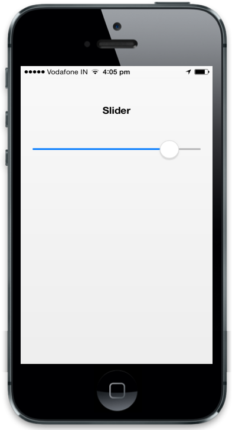

## Customize value

The attribute data-ej-value is used to set the value for the Slider on initialization. The attribute data-ej-maxvalue is the maximum value, the Slider can hold and data-ej-minvalue attribute is the minimum value the Slider can hold. The attribute data-ej-incrementstep specifies the step-by-step increment value of the Slider when the Slider knob is dragged. You can refer the following code example.



        

    



The following screenshot displays the customized Slider Value:

{  | markdownify }
{:.image }

